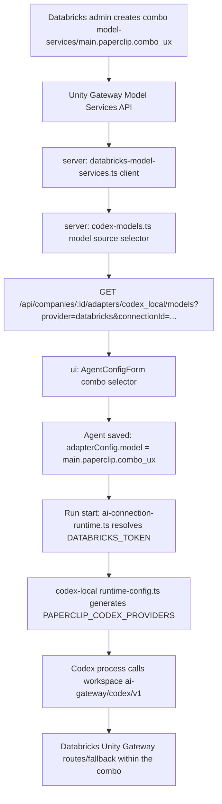
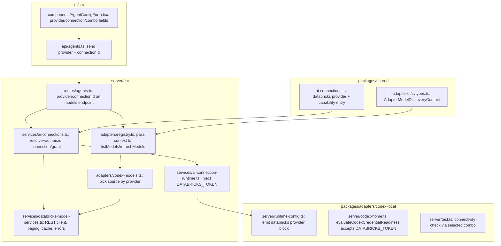
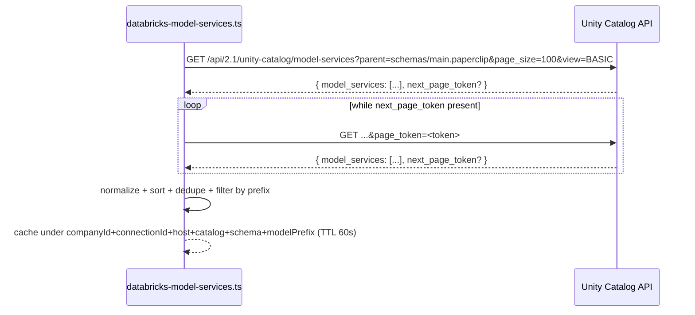

# Design Document: Databricks Unity Gateway Combos Integration

## Overview

This feature makes Databricks Unity Gateway "combos" (Model Services) available as selectable
models inside the existing `codex_local` adapter, without introducing a new adapter type. A
company connects to a Databricks workspace once (a new `databricks` AI Connection provider,
`api_key`/PAT method only in this scope). From that point, any Model Service the connection's
token can read under the configured `catalog.schema` appears in the agent's model selector as a
"Combo". Selecting a combo persists its qualified name (e.g. `main.paperclip.combo_ux`) as the
agent's `model`, and Paperclip transparently generates a per-run Codex model-provider entry
(`base_url = https://<workspace>/ai-gateway/codex/v1`, `wire_api = "responses"`) so the existing
Codex process talks to the workspace's Unity Gateway instead of OpenAI.

The design reuses three mechanisms that already exist in the codebase rather than inventing new
ones: the `AI_CONNECTION_CAPABILITIES` table in `packages/shared/src/ai-connections.ts` (extended
with a `databricks` entry), the adapter model-discovery contract (`listModels`/`refreshModels` on
`ServerAdapterModule`, extended with an optional context parameter), and the `PAPERCLIP_CODEX_PROVIDERS`
env-var + `prepareCodexRuntimeConfig` merge mechanism already used by `codex-local` to inject
gateway-style providers into `config.toml` per run. All new server-side logic is additive: a new
`databricks-model-services.ts` service performs discovery, and existing routes/services gain a
`provider=databricks` branch.

Every discovery and execution path is company-scoped and grant-scoped, matching the repository's
core invariant that all domain entities enforce company boundaries. No fallback to OpenAI happens
when Databricks is unavailable or the selected combo has disappeared — the run fails closed with
an actionable error, and mutating actions on the Databricks connection (create/edit/revoke) write
activity log entries like every other AI Connection change.

## Architecture



### Component responsibilities



## Data Models

### AI Connections (`packages/shared/src/ai-connections.ts`)

`AI_PROVIDERS` gains `"databricks"`. `AI_CONNECTION_CAPABILITIES.databricks` maps to the
`codex_local` adapter only, `api_key` method only, `env_key: "DATABRICKS_TOKEN"`:

```pascal
AI_PROVIDERS := AI_PROVIDERS + ["databricks"]

AI_CONNECTION_CAPABILITIES["databricks"] := {
  name: "Databricks Unity Gateway",
  methods: {
    api_key: { adapters: ["codex_local"], envKey: "DATABRICKS_TOKEN" }
  }
}
```

`isAiConnectionCompatible` needs no structural change: it already looks up
`AI_CONNECTION_CAPABILITIES[provider].methods[method].adapters.includes(adapterType)`. Databricks
becomes compatible with `codex_local` for free once the table entry exists.

The `createAiConnectionSchema` shape (name, ownership, apiKey, agentIds, allAgents) is reused
as-is for the credential envelope. Databricks-specific fields (workspace URL, catalog, schema,
optional model prefix) are **not** generic AI Connection fields — they are Databricks-specific
connection *configuration*, stored alongside the credential the same way other provider-specific
config is stored today (see "Connection config storage" below).

### Connection config storage

The existing `toolConnections` row (via `packages/db`) already carries a `config` JSON column used
by other provider integrations for non-secret settings. Databricks connections store:

```ts
interface DatabricksConnectionConfig {
  workspaceHost: string; // origin only, e.g. "https://acme.cloud.databricks.com"
  catalog: string;
  schema: string;
  modelPrefix?: string;
}
```

This is validated with a Zod schema in `packages/shared` (`databricksConnectionConfigSchema`) and
is never given a discriminated union with the credential — the PAT itself is written through the
existing `secretService`/`companySecrets` path, exactly like other `api_key` AI Connections. No
`packages/db` schema migration is required: the existing `toolConnections.config` JSON column
already accepts provider-specific shapes, so this stays within the existing polymorphic contract.
If review determines the JSON shape needs first-class columns later, that is an additive
`packages/db` migration, not part of this design.

### Adapter Model Discovery Context (`packages/adapter-utils/src/types.ts`)

```ts
export interface AdapterModelDiscoveryContext {
  companyId: string;
  provider?: string;
  connectionId?: string;
  refresh?: boolean;
  /** Resolved server-side only; never serialized back to the client. */
  resolvedCredential?: {
    token: string;
    host: string;
    catalog: string;
    schema: string;
    modelPrefix?: string;
  };
}
```

`ServerAdapterModule.listModels` and `.refreshModels` become contextual and backward compatible:

```ts
export interface ServerAdapterModule {
  // ...
  listModels?: (context?: AdapterModelDiscoveryContext) => Promise<AdapterModel[]>;
  refreshModels?: (context?: AdapterModelDiscoveryContext) => Promise<AdapterModel[]>;
}
```

Existing adapters (Claude, OpenAI/codex without Databricks, OpenRouter) ignore the new parameter;
`context?: AdapterModelDiscoveryContext` is optional so no other adapter implementation needs to
change to keep compiling.

### Unity Catalog Model Services API (external contract)



Server never calls `GET /api/2.0/serving-endpoints` — that is a different resource and is
explicitly out of scope for discovery.

## Components and Interfaces

### `server/src/services/databricks-model-services.ts` (new)

**Purpose**: sole owner of Unity Catalog Model Services REST access: pagination, normalization,
caching, and Databricks-specific error mapping. No other module calls the Databricks HTTP API
directly.

```ts
export interface DatabricksModelServiceCredential {
  host: string;        // origin only, e.g. "https://acme.cloud.databricks.com"
  token: string;        // PAT, resolved server-side, never logged
  catalog: string;
  schema: string;
  modelPrefix?: string;
}

export interface DatabricksDiscoveryKey {
  companyId: string;
  connectionId: string;
  host: string;
  catalog: string;
  schema: string;
  modelPrefix?: string;
}

export type DatabricksDiscoveryErrorKind =
  | "invalid_credential"   // 401
  | "insufficient_permission" // 403
  | "rate_limited"          // 429, carries retryAfterSeconds
  | "unavailable"           // 5xx / network / timeout
  | "invalid_host";         // fails https/origin validation, or host not allowlisted

export class DatabricksDiscoveryError extends Error {
  readonly kind: DatabricksDiscoveryErrorKind;
  readonly retryAfterSeconds?: number;
  constructor(kind: DatabricksDiscoveryErrorKind, message: string, retryAfterSeconds?: number);
}

/** Lists all combos visible to the credential's token under catalog.schema. Cached (60s TTL),
 *  keyed by the full DatabricksDiscoveryKey. `refresh: true` bypasses and repopulates the cache. */
export async function listDatabricksModelServices(
  key: DatabricksDiscoveryKey,
  credential: DatabricksModelServiceCredential,
  options?: { refresh?: boolean },
): Promise<{ id: string; label: string }[]>;

/** Invalidates every cache entry for a connection. Called on connection edit/revoke. */
export function invalidateDatabricksModelServiceCache(connectionId: string): void;
```

Internal pseudocode:

```pascal
FUNCTION listDatabricksModelServices(key, credential, options)
  ASSERT credential.host STARTS WITH "https://"
  ASSERT hostIsAllowlistedOrPrivateEnabled(credential.host)

  cacheKey ← serialize(key)  // companyId + connectionId + host + catalog + schema + modelPrefix
  IF NOT options.refresh THEN
    cached ← cache.get(cacheKey)
    IF cached EXISTS AND NOT cached.expired THEN
      RETURN cached.value
    END IF
  END IF

  services ← []
  nextPageToken ← NULL
  DO
    response ← httpGetWithTimeout(
      url: credential.host + "/api/2.1/unity-catalog/model-services",
      query: {
        parent: "schemas/" + credential.catalog + "." + credential.schema,
        page_size: 100,
        page_token: nextPageToken,
        view: "BASIC",
      },
      headers: { Authorization: "Bearer " + credential.token },
      timeoutMs: 10000,
    )
    handleHttpStatus(response)  // maps 401/403/429/5xx -> DatabricksDiscoveryError
    services.append(response.body.model_services)
    nextPageToken ← response.body.next_page_token
  WHILE nextPageToken IS NOT NULL

  normalized ← services
    .map(toAdapterModel)
    .filter(m => qualifiesUnderCatalogSchema(m.id, credential.catalog, credential.schema))
    .filter(m => credential.modelPrefix IS NULL OR shortName(m.id) STARTS WITH credential.modelPrefix)
  deduped ← dedupeById(normalized)
  sorted ← sortByLabel(deduped)

  cache.set(cacheKey, sorted, ttl: 60_SECONDS)
  RETURN sorted
END FUNCTION

FUNCTION handleHttpStatus(response)
  IF response.status = 401 THEN RAISE DatabricksDiscoveryError("invalid_credential", ...)
  IF response.status = 403 THEN RAISE DatabricksDiscoveryError("insufficient_permission", ...)
  IF response.status = 429 THEN
    retryAfter ← parseRetryAfterHeader(response.headers)
    RAISE DatabricksDiscoveryError("rate_limited", ..., retryAfter)
  END IF
  IF response.status >= 500 THEN RAISE DatabricksDiscoveryError("unavailable", ...)
  IF response.timedOut THEN RAISE DatabricksDiscoveryError("unavailable", "timeout", ...)
END FUNCTION

FUNCTION toAdapterModel(resourceName)
  id ← resourceName.removePrefix("model-services/")
  shortName ← id.split(".").last() OR id
  label ← shortName
    .removePrefix(/^combo[-_]?/i) → prepend "Combo "
    .replaceAll(/[-_]+/, " ")
    .titleCase()
    .trim()
  RETURN { id, label }
END FUNCTION
```

**Error mapping to HTTP responses** (applied by the caller, `routes/agents.ts`):

| Databricks condition | `DatabricksDiscoveryErrorKind` | HTTP status returned to UI |
| --- | --- | --- |
| Bad/expired PAT | `invalid_credential` | 401 |
| Token lacks catalog/schema/service grants | `insufficient_permission` | 403 |
| Rate limit / quota | `rate_limited` | 429 (echo `Retry-After` if present) |
| Workspace 5xx / timeout / network error | `unavailable` | 502 (upstream failure, distinct from 500 which the repo reserves for Paperclip's own bugs) |
| Malformed/disallowed host | `invalid_host` | 422 |

No case maps to a silent 200 with empty results substituted for OpenAI models — an error always
surfaces as an error.

### `server/src/adapters/codex-models.ts` (existing, extended)

**Purpose**: given a discovery request for `codex_local`, pick the single correct model source
(OpenAI-declared models, or Databricks combos) and never merge the two lists.

```ts
export async function listCodexModels(
  context: AdapterModelDiscoveryContext,
): Promise<AdapterModel[]> {
  if (context.provider === "databricks") {
    if (!context.resolvedCredential) {
      throw new UnprocessableError("Databricks connection is required to list combos");
    }
    return listDatabricksModelServices(
      {
        companyId: context.companyId,
        connectionId: context.connectionId!,
        host: context.resolvedCredential.host,
        catalog: context.resolvedCredential.catalog,
        schema: context.resolvedCredential.schema,
        modelPrefix: context.resolvedCredential.modelPrefix,
      },
      context.resolvedCredential,
      { refresh: context.refresh },
    );
  }
  return listDeclaredOrStaticOpenAiModels(); // existing behavior, unchanged
}
```

This function is the single seam that guarantees "never mix OpenAI models with Databricks combos
in the same list" (Section 6 of the source spec).

### `server/src/adapters/registry.ts` (existing, extended)

`listAdapterModels`/`refreshAdapterModels` gain an optional context parameter, threaded straight
through to the adapter module:

```ts
export async function listAdapterModels(
  type: string,
  context?: AdapterModelDiscoveryContext,
): Promise<{ id: string; label: string }[]> {
  const declaredModels = getDeclaredAdapterModels();
  if (declaredModels && declaredModels[type]?.length && context?.provider !== "databricks") {
    // PAPERCLIP_ADAPTER_MODELS stays an OpenAI-only override path; Databricks
    // discovery always goes live because combos are workspace-managed, not
    // an admin-declared static list.
    return declaredModels[type].map((m) => ({ id: m.id, label: m.label ?? m.id }));
  }
  const adapter = findActiveServerAdapter(type);
  if (!adapter) return [];
  if (adapter.listModels) {
    const discovered = await adapter.listModels(context);
    if (discovered.length > 0) return discovered;
  }
  return adapter.models ?? [];
}

export async function refreshAdapterModels(
  type: string,
  context?: AdapterModelDiscoveryContext,
): Promise<{ id: string; label: string }[]> {
  const adapter = findActiveServerAdapter(type);
  if (!adapter) return [];
  const refreshContext = { ...context, refresh: true };
  if (adapter.refreshModels) {
    const refreshed = await adapter.refreshModels(refreshContext);
    if (refreshed.length > 0) return refreshed;
  }
  if (adapter.listModels) {
    const discovered = await adapter.listModels(refreshContext);
    if (discovered.length > 0) return discovered;
  }
  return adapter.models ?? [];
}
```

The `codex_local` `ServerAdapterModule.listModels`/`refreshModels` implementation (registered in
`packages/adapters/codex-local/src/server/index.ts`) delegates to `codex-models.ts` when
`context?.provider === "databricks"`, and preserves its current behavior otherwise.

### `server/src/routes/agents.ts` (existing, extended)

```ts
router.get("/companies/:companyId/adapters/:type/models", async (req, res) => {
  const companyId = req.params.companyId;
  assertCompanyAccess(req, companyId); // existing: company-scoped, unchanged
  const type = req.params.type;
  const refresh = asBoolean(req.query.refresh);
  const provider = asNonEmptyString(req.query.provider);
  const connectionId = asNonEmptyString(req.query.connectionId);

  if (provider === "databricks") {
    if (!connectionId) throw new UnprocessableError("connectionId is required for provider=databricks");
    // resolveAndAuthorize enforces: connection belongs to companyId, actor has a
    // usable grant (personal or shared+audience), connection is not revoked.
    const resolved = await aiConnectionService(db).resolveDatabricksCredential(
      companyId,
      connectionId,
      responsibleUserForAiRequest(req),
    );
    if (!resolved.ok) {
      // Maps resolution failures (see ai-connections.ts) to 401/403/404/409.
      throw mapAiConnectionResolutionToHttpError(resolved);
    }
    const context: AdapterModelDiscoveryContext = {
      companyId,
      provider,
      connectionId,
      refresh,
      resolvedCredential: resolved.credential,
    };
    const models = refresh
      ? await refreshAdapterModels(type, context)
      : await listAdapterModels(type, context);
    res.json(models); // only { id, label } — token/host/catalog/schema never serialized
    return;
  }

  // existing OpenAI / other-provider branch, unchanged
  const models = refresh ? await refreshAdapterModels(type) : await listAdapterModels(type);
  res.json(models);
});
```

This preserves the existing endpoint shape (`GET /api/companies/:companyId/adapters/codex_local/models?provider=databricks&connectionId=<uuid>&refresh=1`)
that the source spec calls for, and matches the pattern already used for
`opencode_local`+`openrouter` in this same route file.

### `server/src/services/ai-connections.ts` (existing, extended)

New method resolves and authorizes a Databricks connection/grant, without ever returning the
token to a caller that might serialize it back to the client:

```ts
export interface DatabricksCredentialResolution {
  ok: true;
  credential: {
    token: string;
    host: string;
    catalog: string;
    schema: string;
    modelPrefix?: string;
  };
  attribution: AiConnectionAttribution;
}
export type DatabricksCredentialResolutionFailure = {
  ok: false;
  reason: AiConnectionUnavailableReason; // reuses existing enum: connection_missing,
                                          // access_denied, credential_missing, connection_unavailable, ...
  message: string;
};

async function resolveDatabricksCredential(
  companyId: string,
  connectionId: string,
  userId: string | null,
): Promise<DatabricksCredentialResolution | DatabricksCredentialResolutionFailure> {
  const row = await findConnectionAndGrant(companyId, connectionId); // existing helper pattern
  if (!row) return { ok: false, reason: "connection_missing", message: "Connection not found" };
  if (row.connection.provider !== "databricks")
    return { ok: false, reason: "incompatible", message: "Connection is not a Databricks connection" };
  if (!canUseCredential(row.grant, userId, await audienceFor(row.grant)))
    return { ok: false, reason: "access_denied", message: "No usable grant for this connection" };
  if (row.connection.status === "revoked")
    return { ok: false, reason: "connection_unavailable", message: "Connection has been revoked" };

  const token = await secrets.resolve(row.connection.credentialRef); // existing secret resolution path
  if (!token) return { ok: false, reason: "credential_missing", message: "No credential stored" };

  const config = databricksConnectionConfigSchema.parse(row.connection.config);
  return {
    ok: true,
    credential: { token, host: config.workspaceHost, catalog: config.catalog, schema: config.schema, modelPrefix: config.modelPrefix },
    attribution: buildAttribution(row), // existing shape
  };
}
```

Every branch validates company membership (via `findConnectionAndGrant` scoping by `companyId`)
before touching the grant or the secret, so cross-company access is structurally impossible: a
`connectionId` from another company simply does not match the `companyId`-scoped query and returns
`connection_missing`.

### `server/src/services/ai-connection-runtime.ts` (existing, extended)

At run start, when the resolved `AiConnectionBinding.provider === "databricks"`, inject
`DATABRICKS_TOKEN` into the run's env map (mirroring how `OPENAI_API_KEY`/`ANTHROPIC_API_KEY` are
injected today) and pass the connection's `host`/`catalog`/`schema` forward to the adapter's
runtime-config step. The token is written only into the child process environment for the run's
lifetime — never into `adapterConfig`, `config.toml` literal values, run events, or the API
response for the run.

```ts
export async function prepareManagedAiRuntime(
  input: PrepareManagedAiRuntimeInput,
): Promise<PreparedAiRuntime> {
  // existing per-provider branches...
  if (input.binding.provider === "databricks") {
    const resolved = await aiConnectionService(db).resolveDatabricksCredential(
      input.companyId, input.binding.connectionId, input.responsibleUserId,
    );
    if (!resolved.ok) {
      throw new AiConnectionUnavailableError(resolved.reason, resolved.message); // existing error type
    }
    return {
      env: { DATABRICKS_TOKEN: resolved.credential.token },
      providerRuntimeHint: {
        provider: "databricks",
        baseUrl: `${resolved.credential.host}/ai-gateway/codex/v1`,
        wireApi: "responses",
      },
      cleanup: async () => {}, // env is process-scoped and discarded with the child process
    };
  }
  // ...
}
```

`stripAiAuthBindings` (already used to keep bindings out of persisted config/logs) is unchanged in
behavior; it already strips `aiConnection` before persistence, and Databricks bindings follow the
same `AiConnectionBinding` shape (`mode: "shared" | "delegated"`), so no new stripping logic is
needed.

### `packages/adapters/codex-local/src/server/runtime-config.ts` (existing, extended)

The adapter's `execute.ts` already computes an `env` map and calls
`prepareCodexRuntimeConfig({ env, codexHome })`. When `providerRuntimeHint.provider === "databricks"`
is present, `execute.ts` builds a `PAPERCLIP_CODEX_PROVIDERS` JSON payload before that call, reusing
the exact mechanism `parseCodexProvidersConfig` already parses:

```ts
function buildDatabricksProviderEnv(hint: { baseUrl: string; wireApi: string }): string {
  return JSON.stringify({
    providers: {
      databricks: {
        name: "Databricks Unity Gateway",
        base_url: hint.baseUrl,
        env_key: "DATABRICKS_TOKEN",
        wire_api: hint.wireApi,
      },
    },
    model_provider: "databricks",
  });
}
```

This value is set as `env.PAPERCLIP_CODEX_PROVIDERS` for the run only; `prepareCodexRuntimeConfig`
already backs up and restores `config.toml` around the run (existing behavior, unchanged), so the
managed block is written before Codex starts and removed by `cleanup()` after the run, exactly as
it does today for any other `PAPERCLIP_CODEX_PROVIDERS` value. No change to
`parseCodexProvidersConfig`, `buildMergedConfigToml`, or the backup/restore logic is required.

### `packages/adapters/codex-local/src/server/codex-home.ts` (existing, extended)

`evaluateCodexCredentialReadiness` currently treats `OPENAI_API_KEY` presence (or `auth.json`) as
the sole readiness signal (see `resolveCodexBillingType` and the credential-readiness checks in
`execute.ts`). It gains a Databricks-aware branch:

```pascal
FUNCTION evaluateCodexCredentialReadiness(input)
  activeProvider ← input.env.PAPERCLIP_CODEX_PROVIDERS-derived model_provider, IF SET
  IF activeProvider = "databricks" THEN
    RETURN { managed: true, ready: hasNonEmptyEnvValue(input.env, "DATABRICKS_TOKEN") }
  END IF
  // existing OpenAI-oriented checks, unchanged
END FUNCTION
```

This directly satisfies "do not require `OPENAI_API_KEY` when `DATABRICKS_TOKEN` is correctly
resolved" (source spec Section 5) without weakening the existing OpenAI readiness gate for runs
that are not using Databricks.

### `packages/adapters/codex-local/src/server/test.ts` (existing, extended)

Adds a connectivity check path that, when the effective provider is Databricks, issues a minimal
request through `/ai-gateway/codex/v1` using the selected combo, distinct from a full task
execution, and surfaces the same `DatabricksDiscoveryErrorKind` classification for consistent
error messages between "list combos" and "test this agent" flows.

### UI: `ui/src/components/AgentConfigForm.tsx` (existing, extended)

Following the pattern already used for `opencode_local` + `openrouter` (`modelProvider` derived
from the effective `aiConnection.provider`, feeding a `queryKeys.agents.adapterModels(...)` query):

```ts
const modelProvider =
  adapterType === "codex_local" &&
  aiConnectionBindingSchema.safeParse(effectiveAiConnectionBindingValue).data?.provider === "databricks"
    ? "databricks"
    : /* existing runnerProvider/opencode logic */ runnerProvider;

const databricksConnectionId =
  modelProvider === "databricks"
    ? aiConnectionBindingSchema.safeParse(effectiveAiConnectionBindingValue).data?.connectionId
    : undefined;

const modelQueryKey = selectedCompanyId
  ? queryKeys.agents.adapterModels(selectedCompanyId, adapterType, currentDefaultEnvironmentId || null, modelProvider, databricksConnectionId)
  : [...];

const { data: models } = useQuery({
  queryKey: modelQueryKey,
  queryFn: () => agentsApi.adapterModels(selectedCompanyId!, adapterType, {
    environmentId: currentDefaultEnvironmentId || null,
    provider: modelProvider,
    connectionId: databricksConnectionId,
  }),
  enabled: Boolean(selectedCompanyId) && (modelProvider !== "databricks" || Boolean(databricksConnectionId)),
  staleTime: 60_000, // matches server TTL; manual refresh bypasses via refresh:true
});
```

UI-specific rules implemented in this component:

- The model field label switches from "Model" to "Combo" when `modelProvider === "databricks"`.
- A required "Databricks connection" selector gates the combo selector — combos are not fetched
  until a valid connection is chosen (`enabled` guard above).
- "Refresh combos" button calls `agentsApi.adapterModels(..., { refresh: true, ... })`, mirroring
  the existing `refreshModels`/`handleRefreshModels` handler already in this file for other
  providers.
- If the agent's persisted `model` is not present in the fetched combo list, it is still rendered
  as a selectable-but-disabled entry labeled "Unavailable" (existing "unknown model" rendering
  pattern in the combobox, extended with this label), and the save/run action for that agent is
  blocked until a valid combo is re-selected. This reuses the existing "unknown/removed model"
  handling already needed for any adapter whose declared model list can drop an entry.
- OpenAI models and Databricks combos are never combined in the same dropdown: the dropdown's data
  source is exactly the single `models` query result above, which the server guarantees is
  single-provider (see `codex-models.ts`).

### UI: `ui/src/api/agents.ts` (existing, extended)

```ts
export function adapterModels(
  companyId: string,
  adapterType: string,
  options?: { refresh?: boolean; environmentId?: string | null; provider?: string; connectionId?: string },
): Promise<AdapterModel[]> {
  const params = new URLSearchParams();
  if (options?.refresh) params.set("refresh", "1");
  if (options?.environmentId) params.set("environmentId", options.environmentId);
  if (options?.provider) params.set("provider", options.provider);
  if (options?.connectionId) params.set("connectionId", options.connectionId);
  return apiGet(`/companies/${companyId}/adapters/${adapterType}/models?${params}`);
}
```

## Correctness Properties

### Property 1: Qualified-name round trip

**Validates: Requirements 2.3**

For every Model Service resource name matching `model-services/<catalog>.<schema>.<name>`,
`toAdapterModel(resourceName).id` equals `resourceName` with exactly the `model-services/` prefix
removed, and re-prefixing `toAdapterModel(resourceName).id` with `model-services/` reproduces the
original resource name.

### Property 2: Pagination completeness

**Validates: Requirements 2.2**

`listDatabricksModelServices` returns the union of every page's `model_services`, and issues
exactly `ceil(total / page_size)` requests, regardless of how many pages the mock server returns,
terminating iff `next_page_token` is absent/empty on the last response.

### Property 3: Schema containment

**Validates: Requirements 2.8**

For every model returned by `listDatabricksModelServices`, the id's `catalog.schema` prefix equals
the credential's `catalog.schema` — no model from a different schema is ever included, even if the
Databricks response includes one (defensive filter).

### Property 4: Cache tenant isolation

**Validates: Requirements 2.10, 3.5**

For any two `DatabricksDiscoveryKey` values that differ in `companyId`, `connectionId`, `host`,
`catalog`, `schema`, or `modelPrefix`, their cache entries are distinct; a cache hit for key K1
never serves a value cached under a different key K2 ≠ K1.

### Property 5: Cache freshness

**Validates: Requirements 2.9, 2.11**

A cached value is served if and only if `now - cachedAt < 60_000ms` and `refresh` was not
requested; `refresh: true` always bypasses and repopulates the cache for that key.

### Property 6: No cross-provider mixing

**Validates: Requirements 4.4**

`listCodexModels(context)` returns models from exactly one source — Databricks when
`context.provider === "databricks"`, OpenAI/declared otherwise — never a concatenation of both.

### Property 7: No silent OpenAI fallback

**Validates: Requirements 4.1**

Whenever `resolveDatabricksCredential` returns `ok: false`, or `listDatabricksModelServices`
throws `DatabricksDiscoveryError`, the models endpoint responds with a non-2xx status and an
empty/absent model list is never silently substituted with OpenAI's declared models for a
`provider=databricks` request.

### Property 8: Secret confinement

**Validates: Requirements 5.1, 5.4**

No server response body, run event payload, activity-log entry, or log line produced by any
module in this design contains the literal PAT/token value. (Verified by scanning test
fixtures/log captures for the injected fake token value in integration tests.)

### Property 9: Company isolation

**Validates: Requirements 3.1**

For connection C owned by company A and any company B ≠ A, resolving C's credential using
`companyId = B` always returns `ok: false, reason: "connection_missing"` — the lookup query is
scoped by `companyId` and a differing company id can never match C's row.

### Property 10: HTTPS-only, origin-only host

**Validates: Requirements 1.2, 1.3**

`workspaceHost` values containing userinfo, a path, a query string, or a fragment are rejected at
connection-create time; only `https://` schemes are accepted.

## Error Handling

| Scenario | Detection point | Response |
| --- | --- | --- |
| Missing/invalid `connectionId` for `provider=databricks` | `routes/agents.ts` | 422 |
| Connection not found / belongs to another company | `resolveDatabricksCredential` | 404 |
| No usable grant for actor | `resolveDatabricksCredential` | 403 |
| Connection revoked | `resolveDatabricksCredential` | 409 |
| PAT invalid/expired (Databricks 401) | `databricks-model-services.ts` | 401 |
| Token lacks catalog/schema/service permission (Databricks 403) | `databricks-model-services.ts` | 403 |
| Databricks rate limit (429) | `databricks-model-services.ts` | 429 (`Retry-After` echoed) |
| Databricks 5xx / timeout / network failure | `databricks-model-services.ts` | 502 |
| Malformed/disallowed workspace host | connection create/edit validation | 422 |
| Selected combo no longer present in discovery results | UI render + run start | UI shows "Unavailable"; run start blocked with 409-style validation error, no OpenAI fallback |
| Databricks reachable but the combo itself is disabled/unauthorized at execution time | `codex-local` execute path (Unity Gateway returns 4xx) | Run fails with that HTTP status surfaced in run output; no fallback |

Every mutating action on the Databricks connection resource (create, edit, revoke) writes an
activity log entry via the existing `logActivity` service, matching the repository's activity
logging invariant for mutating actions. Discovery (read-only `GET .../models`) is not itself a
mutation and does not get its own activity-log entry, consistent with how existing model-listing
endpoints behave.

## Testing Strategy

### Unit tests (new: `databricks-model-services.test.ts`, `codex-models.test.ts` extension)

- prefix stripping (`model-services/` removal only)
- label normalization (`combo_ux` → `Combo UX`, `combo-dev` → `Combo Dev`)
- pagination loop terminates correctly and aggregates all pages
- sorting by label and de-duplication by id
- prefix filter (`modelPrefix`) inclusion/exclusion
- schema-containment filter rejects cross-schema entries defensively
- `refresh: true` bypasses cache; subsequent non-refresh call within TTL hits cache
- HTTP 401/403/429 (with and without `Retry-After`)/5xx/timeout each map to the correct
  `DatabricksDiscoveryErrorKind`
- no log line or thrown error message contains the raw token (assert via fixture value substring
  search)

### Integration tests (server, new + extensions to `routes/agents.ts` tests and `ai-connections.ts` tests)

- company A cannot see or resolve company B's Databricks connection (404/`connection_missing`)
- actor without a usable grant on a shared connection gets 403
- revoked connection cannot list models or execute a run (409 / run start blocked)
- a newly created combo appears after a `refresh=1` call without restarting the server (achieved
  in-test by seeding a second fixture response and calling refresh)
- a combo removed from the Databricks response does not fall back to OpenAI's model list; the
  endpoint/response reflects the removal, and a run attempt with the stale model is blocked
- the generated `PAPERCLIP_CODEX_PROVIDERS` payload contains `/ai-gateway/codex/v1` and
  `wire_api: "responses"` for the workspace under test
- the spawned child process receives `DATABRICKS_TOKEN` in its env; the HTTP response body, run
  event rows, and activity log entries for the same run contain no token substring
- the executed run's Codex `model` field equals exactly the persisted combo id, unmodified

### E2E (manual, matching source spec Section 12 "E2E manual")

1. Create a Databricks connection in Paperclip.
2. Select `main.paperclip.combo_dev` and run a short task.
3. Create `main.paperclip.combo_ux` in Databricks.
4. Open the combo selector or click "Refresh combos".
5. Confirm "Combo UX" appears without code edits or service restarts.
6. Select the new combo and run a task.
7. Confirm in Databricks that the call was attributed to the correct Model Service.
8. Revoke the grant and confirm Paperclip surfaces an access error without exposing the token.

## Security Considerations

- PAT is stored only via the existing `secretService`/`companySecrets` path; never written into
  `adapterConfig`, `config.toml` literal values (only `env_key` indirection is written to
  `config.toml`), run events, activity-log entries, or API responses.
- `DATABRICKS_TOKEN` exists only in the spawned Codex process's environment for the run's
  duration; `runtime-config.ts` cleanup restores `config.toml` after the run, matching the existing
  restore behavior for any custom `PAPERCLIP_CODEX_PROVIDERS` value.
- Workspace URLs are normalized to origin-only at connection create/edit time; userinfo, path,
  query, and fragment are rejected. Only `https://` is accepted.
- A host allowlist applies for SaaS deployments; private/self-hosted workspace hosts require
  explicit administrator opt-in, mirroring the source spec's Section 8 requirement.
- Discovery requests use a 10-second timeout and a bounded response size.
- `429` responses respect `Retry-After` when present; no automatic cross-organization credential
  fallback ever occurs.

## Performance Considerations

- Discovery uses `view=BASIC` exclusively — never `view=FULL` — to avoid pulling routing/target
  detail into the selector.
- Cache TTL is 60 seconds per exact `(companyId, connectionId, host, catalog, schema, modelPrefix)`
  tuple; manual refresh bypasses but repopulates the same-keyed entry.
- No LLM call is made during discovery; combos list is never included in any agent prompt.
- Pagination requests `page_size=100` (the Databricks-documented max) to minimize round trips.

## Dependencies

- Existing: `packages/shared` AI Connections module, `secretService`, `activity-log` service,
  `@paperclipai/db` `toolConnections`/`connectionGrants` schema (no migration required for this
  scope), existing `codex_local` adapter and its `PAPERCLIP_CODEX_PROVIDERS` mechanism.
- New: none — no new third-party npm dependency is required; the Databricks REST client uses the
  same HTTP client utility already used elsewhere in `server/src/services/*`.

## Implementation Order (informs tasks.md)

Mirrors the source specification's T01–T12 sequencing, retained here because later tasks in this
feature depend on earlier ones being contract-complete first (shared contracts before server
logic, server logic before UI, correctness before observability, targeted tests throughout, full
verification last):

1. Shared contracts — `databricks` AI Connection provider/capability, `AdapterModelDiscoveryContext`.
2. Databricks REST client — pagination, normalization, timeout, error mapping.
3. Security — company/grant-scoped credential resolution, cross-tenant denial.
4. Model registry plumbing — context threading through `listAdapterModels`/`refreshAdapterModels`.
5. Runtime — per-run Codex provider generation (`base_url`, `env_key`, `wire_api`).
6. Auth readiness — accept `DATABRICKS_TOKEN` without requiring `OPENAI_API_KEY`.
7. API — extend the models endpoint with `provider`/`connectionId`, 60s cache.
8. UI — provider/connection/combo selection with refresh and "Unavailable" state.
9. Observability — provider/combo/tokens/latency/errors without secrets.
10. Unit + integration tests per the Testing Strategy above.
11. Manual E2E per the eight-step script above.
12. Final review against the acceptance criteria enumerated in `requirements.md`.
