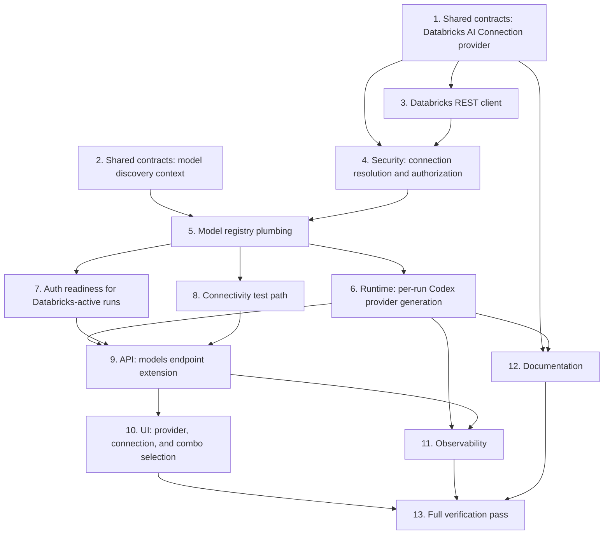

# Implementation Plan: Databricks Unity Gateway Combos Integration

## Overview

This plan implements `design.md` and satisfies `requirements.md`. It makes Databricks Unity
Gateway "combos" (Model Services) selectable inside the existing `codex_local` adapter: a new
`databricks` AI Connection provider, a Unity Catalog Model Services REST client with caching and
error mapping, company/grant-scoped credential resolution, model-registry and runtime plumbing so
runs transparently talk to the workspace's Unity Gateway instead of OpenAI, and the corresponding
UI combo selector. Tasks are ordered so that shared contracts land before server logic, server
logic before UI, and correctness/security checks are verified before observability polish. Each
task lists the requirements it satisfies.

## Tasks

- [x] 1. Shared contracts: Databricks AI Connection provider
  - [x] 1.1 Add `"databricks"` to `AI_PROVIDERS` and a `databricks` entry to
        `AI_CONNECTION_CAPABILITIES` in `packages/shared/src/ai-connections.ts` (adapters:
        `["codex_local"]`, methods: `{ api_key: { envKey: "DATABRICKS_TOKEN" } }`)
    - _Requirements: 1.1, 7.1_
  - [x] 1.2 Add `databricksConnectionConfigSchema` (Zod) in `packages/shared` for
        `{ workspaceHost, catalog, schema, modelPrefix? }`, with `workspaceHost` validated as an
        `https://`-only origin (no userinfo, path, query, or fragment)
    - _Requirements: 1.2, 1.3_
  - [x] 1.3 Write unit tests for the schema: accept a bare `https://host` origin; reject
        `http://`, paths, query strings, fragments, and userinfo
    - _Requirements: 1.2, 1.3_

- [x] 2. Shared contracts: model discovery context
  - [x] 2.1 Add `AdapterModelDiscoveryContext` interface to `packages/adapter-utils/src/types.ts`
        with `companyId`, optional `provider`, `connectionId`, `refresh`, and optional
        `resolvedCredential` (`token`, `host`, `catalog`, `schema`, `modelPrefix?`)
    - _Requirements: 7.2_
  - [x] 2.2 Change `ServerAdapterModule.listModels`/`refreshModels` signatures to accept an
        optional `context?: AdapterModelDiscoveryContext` parameter
    - _Requirements: 7.2_
  - [x] 2.3 Run `pnpm -r typecheck` scoped to `packages/adapter-utils` and every adapter package to
        confirm the optional parameter does not break existing `listModels`/`refreshModels`
        implementations
    - _Requirements: 7.2_

- [x] 3. Databricks REST client: `server/src/services/databricks-model-services.ts`
  - [x] 3.1 Implement `DatabricksModelServiceCredential`, `DatabricksDiscoveryKey`,
        `DatabricksDiscoveryErrorKind`, and `DatabricksDiscoveryError` per `design.md`
    - _Requirements: 2.1, 10.1, 10.2, 10.3, 10.4, 10.5_
  - [x] 3.2 Implement the paginated fetch against
        `GET /api/2.1/unity-catalog/model-services` (`parent=schemas/<catalog>.<schema>`,
        `page_size=100`, `view=BASIC`), looping on `next_page_token` until absent
    - _Requirements: 2.1, 2.2, 11.1, 11.2_
  - [x] 3.3 Implement `toAdapterModel` normalization (strip `model-services/` prefix, derive label
        from the last dot-segment, strip a leading `combo`/`combo_`/`combo-` token, title-case)
    - _Requirements: 2.3, 2.4_
  - [x] 3.4 Implement de-duplication by id, sort by label, optional `modelPrefix` filtering, and a
        defensive catalog/schema-containment filter that drops any entry outside the credential's
        configured `catalog.schema`
    - _Requirements: 2.5, 2.6, 2.7, 2.8_
  - [x] 3.5 Implement the in-process cache keyed by the full `DatabricksDiscoveryKey`
        (`companyId + connectionId + host + catalog + schema + modelPrefix`), 60-second TTL,
        `refresh: true` bypass-and-repopulate semantics, and `invalidateDatabricksModelServiceCache`
    - _Requirements: 2.9, 2.10, 2.11, 3.4_
  - [x] 3.6 Implement HTTP status-to-`DatabricksDiscoveryErrorKind` mapping (401 → invalid
        credential, 403 → insufficient permission, 429 → rate limited with `Retry-After` capture,
        5xx/timeout/network → unavailable), a 10-second timeout, and a bounded response size limit
    - _Requirements: 10.1, 10.2, 10.3, 10.4, 11.5_
  - [x] 3.7 Write unit tests: prefix stripping, label normalization cases, pagination termination
        and aggregation, sort/dedupe, prefix filter, schema-containment filter, cache hit/miss/TTL
        expiry/refresh-bypass, each HTTP error class mapping, and a token-non-leak assertion across
        every thrown error message and log call
    - _Requirements: 2.1–2.11, 5.4, 10.1–10.4_

- [x] 4. Security: connection resolution and authorization
  - [x] 4.1 Add `resolveDatabricksCredential(companyId, connectionId, userId)` to
        `server/src/services/ai-connections.ts`, scoping the connection lookup by `companyId`,
        validating `provider === "databricks"`, checking grant usability via the existing
        `canUseCredential` helper, checking revocation status, and resolving the token via
        `secretService`
    - _Requirements: 1.6, 3.1, 3.2, 3.3, 3.5_
  - [x] 4.2 Ensure a `connectionId` belonging to a different company resolves to
        `{ ok: false, reason: "connection_missing" }` rather than revealing existence
    - _Requirements: 3.1_
  - [x] 4.3 Wire connection edit/revoke mutations to call
        `invalidateDatabricksModelServiceCache(connectionId)` and to write an activity log entry via
        the existing `logActivity` service
    - _Requirements: 1.5, 3.4_
  - [x] 4.4 Write integration tests: cross-company `connectionId` returns not-found; actor without
        a usable grant gets `access_denied`; revoked connection is denied; token is never included
        in the resolution result serialized anywhere client-visible
    - _Requirements: 1.6, 3.1, 3.2, 3.3, 3.5, 5.1_

- [x] 5. Model registry plumbing
  - [x] 5.1 Update `listAdapterModels`/`refreshAdapterModels` in `server/src/adapters/registry.ts`
        to accept and forward an optional `AdapterModelDiscoveryContext`, and to skip the
        `PAPERCLIP_ADAPTER_MODELS` static-override short-circuit when `context?.provider ===
        "databricks"`
    - _Requirements: 7.2_
  - [x] 5.2 Implement `listCodexModels(context)` in `server/src/adapters/codex-models.ts`: route to
        `listDatabricksModelServices` when `context.provider === "databricks"` (requiring
        `resolvedCredential`), otherwise preserve existing OpenAI/declared-model behavior; never
        merge both sources
    - _Requirements: 2.1, 4.4, 7.2_
  - [x] 5.3 Wire the `codex_local` `ServerAdapterModule.listModels`/`refreshModels` implementation
        (`packages/adapters/codex-local/src/server/index.ts`) to delegate to `listCodexModels`
    - _Requirements: 7.2_
  - [x] 5.4 Write unit tests confirming a `provider=databricks` context never returns OpenAI models
        and a non-Databricks context is unaffected by the new branch
    - _Requirements: 4.4_

- [x] 6. Runtime: per-run Codex provider generation for Databricks
  - [x] 6.1 Extend `server/src/services/ai-connection-runtime.ts` `prepareManagedAiRuntime` with a
        `provider === "databricks"` branch that resolves the credential, injects `DATABRICKS_TOKEN`
        into the run env, and returns a `providerRuntimeHint` (`baseUrl`, `wireApi`)
    - _Requirements: 5.2, 6.1_
  - [x] 6.2 Confirm `stripAiAuthBindings` already excludes the Databricks binding from persisted
        config/logs without modification; add a regression test if the existing coverage does not
        already include a `databricks`-provider binding
    - _Requirements: 5.1_
  - [x] 6.3 In `packages/adapters/codex-local/src/server/execute.ts`, when a `providerRuntimeHint`
        with `provider: "databricks"` is present, build the `PAPERCLIP_CODEX_PROVIDERS` JSON
        payload (`base_url = <host>/ai-gateway/codex/v1`, `env_key = "DATABRICKS_TOKEN"`,
        `wire_api = "responses"`, `model_provider = "databricks"`) and set it as a run-scoped env var
        before calling `prepareCodexRuntimeConfig`
    - _Requirements: 5.3, 6.1, 6.2_
  - [x] 6.4 Confirm the Codex `model` field passed to the run equals the persisted combo id exactly
        (no re-normalization at execution time)
    - _Requirements: 6.2_
  - [x] 6.5 Write integration tests: generated provider payload contains
        `/ai-gateway/codex/v1` and `wire_api: "responses"`; the spawned process env contains
        `DATABRICKS_TOKEN`; the API response, run events, and activity log for the same run contain
        no token substring; `config.toml` is restored after the run completes or crashes before
        cleanup
    - _Requirements: 5.1, 5.2, 5.3, 5.5, 6.1, 6.2_

- [x] 7. Auth readiness for Databricks-active runs
  - [x] 7.1 Extend `evaluateCodexCredentialReadiness` (`packages/adapters/codex-local/src/server/codex-home.ts`)
        to treat a non-empty `DATABRICKS_TOKEN` as sufficient readiness when the active provider is
        `databricks`, without requiring `OPENAI_API_KEY`
    - _Requirements: 6.3_
  - [x] 7.2 Confirm existing OpenAI-oriented readiness checks are unchanged for non-Databricks runs
    - _Requirements: 6.4_
  - [x] 7.3 Write unit tests for both branches: Databricks-active run ready with only
        `DATABRICKS_TOKEN` set; OpenAI-active run's existing readiness behavior unchanged
    - _Requirements: 6.3, 6.4_

- [x] 8. Connectivity test path
  - [x] 8.1 Extend `packages/adapters/codex-local/src/server/test.ts` to run a minimal connectivity
        check through `/ai-gateway/codex/v1` using the selected combo when the effective provider is
        Databricks, reusing `DatabricksDiscoveryErrorKind` classification for the result message
    - _Requirements: 6.1, 10.1–10.4_

- [x] 9. API: models endpoint extension
  - [x] 9.1 Extend `GET /companies/:companyId/adapters/:type/models` in
        `server/src/routes/agents.ts` to accept `provider` and `connectionId` query params; require
        `connectionId` when `provider=databricks` (`422` if missing)
    - _Requirements: 2.9, 7.3, 10.5_
  - [x] 9.2 Call `resolveDatabricksCredential`, map resolution failures to the HTTP statuses defined
        in Requirement 10 (404/403/409), and build the `AdapterModelDiscoveryContext` for the
        `listAdapterModels`/`refreshAdapterModels` call
    - _Requirements: 3.1, 3.2, 3.3, 10.6_
  - [x] 9.3 Ensure the JSON response contains only `{ id, label }` per model — never `host`,
        `catalog`, `schema`, or `token`
    - _Requirements: 1.6, 5.1_
  - [x] 9.4 Write integration tests: missing `connectionId` → 422; invalid/expired PAT → 401;
        insufficient permission → 403; rate limited → 429 with `Retry-After` echoed when present;
        Databricks 5xx/timeout → 502; malformed host → 422; response body never contains
        host/catalog/schema/token fields
    - _Requirements: 9.1–9.4, 10.1–10.6_

- [x] 10. UI: provider, connection, and combo selection
  - [x] 10.1 In `ui/src/api/agents.ts`, extend `adapterModels(...)` to accept and forward `provider`
        and `connectionId` query params
    - _Requirements: 7.3_
  - [x] 10.2 In `ui/src/components/AgentConfigForm.tsx`, derive `modelProvider = "databricks"` when
        the effective AI connection binding's provider is `databricks`, following the existing
        `opencode_local`/`openrouter` pattern; gate the combo query on a selected connection
    - _Requirements: 8.1, 8.2_
  - [x] 10.3 Wire the existing "Refresh models" action to pass `refresh: true` for the Databricks
        case (reusing the existing refresh handler pattern), and apply a client-side `staleTime` of
        60 seconds matching the server TTL
    - _Requirements: 8.3, 8.6_
  - [x] 10.4 Relabel the model field as "Combo" when `modelProvider === "databricks"`
    - _Requirements: 8.4_
  - [x] 10.5 Extend the "unknown model" rendering path so a saved combo id absent from the current
        discovery result renders as a disabled "Unavailable" entry, and block the save/run action
        for that agent until a valid combo is re-selected
    - _Requirements: 4.2, 8.5_
  - [x] 10.6 Confirm the combo dropdown's data source is exactly the single-provider server
        response (no client-side merging with any other model list)
    - _Requirements: 4.4_

- [x] 11. Observability
  - [x] 11.1 Confirm the existing run-log path (`heartbeat_run_events` / `appendRunEvent`) records
        provider, model (combo id), input/output tokens, latency, and HTTP status for Databricks
        runs using the same fields as other providers; add any missing field plumbing
    - _Requirements: 9.1_
  - [x] 11.2 If Databricks response metadata reliably includes cached-token counts, record them;
        otherwise leave the field absent rather than fabricated
    - _Requirements: 9.2_
  - [x] 11.3 Confirm no code path infers or displays the combo's internal destination model unless
        Databricks metadata provides it directly
    - _Requirements: 9.3_
  - [x] 11.4 Write a test asserting run-log entries for a Databricks run contain no token substring
    - _Requirements: 5.4, 9.4_

- [x] 12. Documentation
  - [x] 12.1 Update `docs/adapters/codex-local.md` with Databricks connection setup and diagnostics
    - _Requirements: 1.1–1.4, 6.1–6.3_
  - [x] 12.2 Update `docs/deploy/environment-variables.md` only if a single-tenant/administered
        fallback env var is retained; otherwise state explicitly that no new deployment-level env
        var is introduced
    - _Requirements: 5.1_

- [x] 13. Full verification pass
  - [x] 13.1 Run `pnpm -r typecheck`, `pnpm test:run`, and `pnpm build`; fix any failures surfaced by
        the new shared contracts, server modules, adapter changes, or UI changes
    - _Requirements: all_
  - [x] 13.2 Re-run the targeted unit/integration suites from tasks 3.7, 4.4, 5.4, 6.5, 7.3, 9.4,
        and 11.4 together and confirm all pass
    - _Requirements: all_
  - [x] 13.3 Execute the manual E2E script from `design.md` Testing Strategy (create connection,
        select existing combo, run task, create new combo in Databricks, refresh, confirm
        appearance, run task, revoke grant, confirm blocked access without token exposure) and
        record the outcome
    - _Requirements: 2.9, 3.3, 4.1, 4.2, 4.3, 5.4_
  - [x] 13.4 Review every acceptance criterion in `requirements.md` against the implemented
        behavior and confirm each is met; review the "Out of Scope" list and confirm none of those
        items were inadvertently implemented
    - _Requirements: all_

## Notes

- Tasks 1 and 2 (shared contracts: AI Connection provider/schema and
  `AdapterModelDiscoveryContext`) are a mandatory prerequisite for every other task — do not start
  task 3 or later until 1 and 2 are complete and `pnpm -r typecheck` passes for the touched
  packages.
- Any change to the shared contracts in tasks 1–2 requires re-running `pnpm -r typecheck` across
  `packages/shared`, `packages/adapter-utils`, and every adapter package before moving on, per the
  design's "Implementation Order."
- Tasks 3 (REST client) and 4 (security/credential resolution) can proceed in parallel once 1–2
  land, since they touch disjoint files, but both must be complete before task 5 (registry
  plumbing) starts.
- Tasks 6, 7, and 8 (runtime, auth readiness, connectivity test) all depend on task 5 and share the
  `codex-local` adapter package — coordinate edits to avoid overlapping changes in the same files.
- Task 9 (API) depends on tasks 3–8 being wired together; task 10 (UI) depends on task 9's endpoint
  contract being stable.
- Task 13 (full verification pass) is the final gate and depends on every other task; do not treat
  it as optional even for a narrowly scoped follow-up change.
- No `packages/db` migration is required for this feature; the existing `toolConnections.config`
  JSON column already accepts the Databricks-specific shape.
- Follow `doc/connections/CONNECTOR-PLAYBOOK.md` for any additional connection-authoring guidance
  not already covered by these tasks.

## Task Dependency Graph

```json
{
  "waves": [
    { "wave": 1, "tasks": [1, 2] },
    { "wave": 2, "tasks": [3] },
    { "wave": 3, "tasks": [4] },
    { "wave": 4, "tasks": [5] },
    { "wave": 5, "tasks": [6, 7, 8] },
    { "wave": 6, "tasks": [9] },
    { "wave": 7, "tasks": [10, 11, 12] },
    { "wave": 8, "tasks": [13] }
  ]
}
```



Textual summary of the same ordering (mirrors `design.md`'s "Implementation Order"):

1. Tasks 1 and 2 (shared contracts) have no dependencies and must land first.
2. Task 3 (REST client) depends on task 1 (provider/schema types).
3. Task 4 (security/credential resolution) depends on tasks 1 and 3.
4. Task 5 (model registry plumbing) depends on tasks 2 and 4.
5. Tasks 6, 7, and 8 (runtime, auth readiness, connectivity test) each depend on task 5 and can
   proceed in parallel with one another.
6. Task 9 (API endpoint extension) depends on tasks 6, 7, and 8.
7. Task 10 (UI) depends on task 9.
8. Task 11 (observability) depends on tasks 6 and 9.
9. Task 12 (documentation) depends on tasks 1 and 6.
10. Task 13 (full verification pass) depends on tasks 10, 11, and 12 — i.e., on everything.
