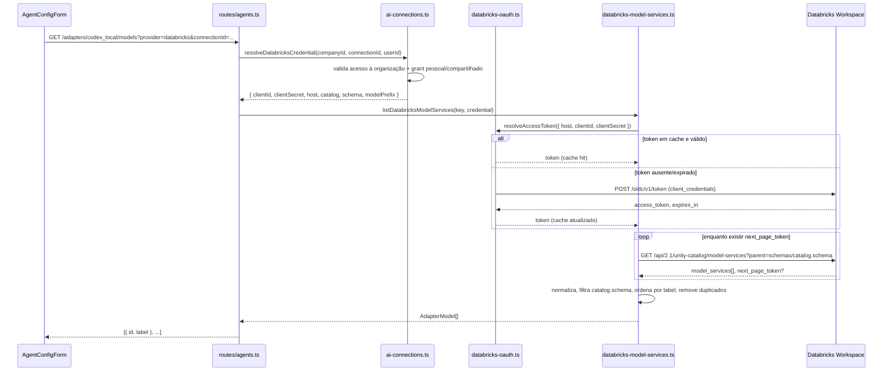
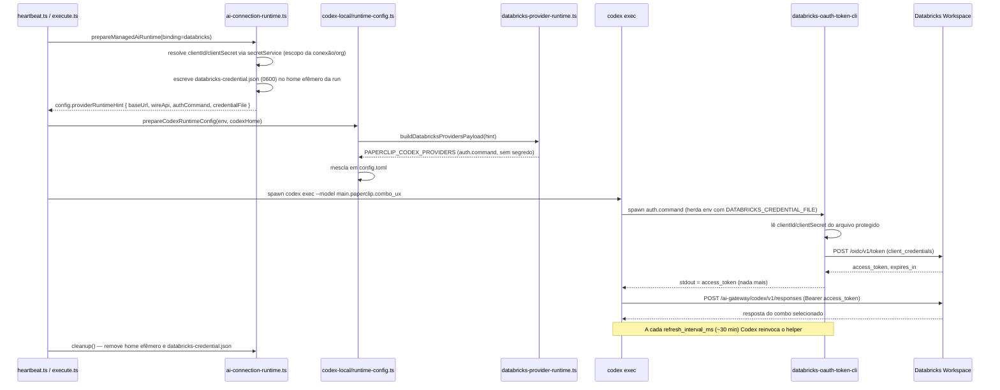

# Design Document: Databricks Unity Gateway — Combos Dinâmicos via OAuth M2M

## Overview

Esta feature evolui a integração já parcialmente implementada entre o Paperclip e o Databricks Unity Gateway. O objetivo permanece o mesmo do documento fonte (`databricks.md`): quando um novo combo (Model Service) é criado no Databricks, ele deve aparecer automaticamente no seletor de modelos do agente `codex_local`, sem cadastro manual duplicado e sem fallback silencioso para a OpenAI.

O que muda nesta revisão (24/09/2026) em relação ao estado atual do repositório é o mecanismo de autenticação: a conexão Databricks deixa de usar um Personal Access Token (PAT) estático (`method: "api_key"`, env var `DATABRICKS_TOKEN`) e passa a usar **OAuth 2.0 Machine-to-Machine (client credentials)** contra um service principal (`method: "oauth_m2m"`, campos `clientId`/`clientSecret`). A execução do Codex passa a resolver o token via um **helper externo de autenticação** (`[model_providers.databricks.auth] command = ...`) em vez de indireção `env_key` para um token fixo. Isso elimina o problema de tokens de curta duração (~1h) expirando em tarefas longas e remove qualquer necessidade de token estático de longa duração no ambiente de execução.

O adapter executor continua sendo o `codex_local`. O Databricks continua sendo um provedor de modelos de primeira classe dentro do fluxo desse adapter — nunca um adapter novo.

## Baseline já existente no repositório

Este design constrói sobre implementação já presente (descoberta paginada de Model Services, contrato `AdapterModelDiscoveryContext`, UI de seleção de combo, isolamento de cache multi-tenant). Os pontos abaixo já existem e são **reaproveitados sem mudança estrutural**:

- `packages/adapter-utils/src/types.ts` — `AdapterModelDiscoveryContext`, `listModels`/`refreshModels` contextuais.
- `server/src/adapters/codex-models.ts` — roteamento `provider === "databricks"` sem merge com modelos OpenAI.
- `server/src/services/databricks-model-services.ts` — paginação, normalização (`toAdapterModel`), cache com TTL de 60s, classificação de erros (`DatabricksDiscoveryError`).
- `server/src/services/databricks-host-policy.ts` — allowlist de host em deployments SaaS.
- `server/src/routes/agents.ts` (endpoint `GET /companies/:companyId/adapters/codex_local/models`) — resolução de conexão/grant antes da descoberta, mapeamento de erros HTTP.
- `ui/src/components/AgentConfigForm.tsx` — seletor "Combo", refresh manual, estado "Indisponível".
- `packages/db/src/schema/ai_provider_defaults.ts` — `databricks` já é um `AiProvider` válido.

Os pontos abaixo **precisam mudar** porque assumem um PAT estático (`DATABRICKS_TOKEN` / `method: "api_key"`) e são o núcleo desta revisão:

- `packages/shared/src/ai-connections.ts` — `aiAuthMethodSchema`, `AI_CONNECTION_CAPABILITIES.databricks`, `createAiConnectionSchema` (campo `apiKey` → `clientId`/`clientSecret`).
- `server/src/services/ai-connections.ts` — `resolveDatabricksCredential` retorna hoje `{ token, host, catalog, schema, modelPrefix }`; passa a retornar `{ clientId, clientSecret, host, catalog, schema, modelPrefix }`.
- `server/src/services/ai-connection-runtime.ts` — injeção de `env.DATABRICKS_TOKEN` via `capability.envKey` é removida; substituída pela preparação de um canal protegido para o helper OAuth M2M.
- `server/src/services/databricks-model-services.ts` — a chamada de descoberta passa a resolver/renovar um access token M2M antes de chamar a Unity Catalog API, em vez de usar um token de credencial já pronto.
- `packages/adapters/codex-local/src/server/databricks-provider-runtime.ts` — `buildDatabricksProvidersPayload` gera `[model_providers.databricks.auth]` (`command`/`args`/`timeout_ms`/`refresh_interval_ms`) em vez de `env_key`.
- `packages/adapters/codex-local/src/server/auth-check.ts` / `codex-home.ts` (readiness) — prontidão do Databricks passa a verificar a conexão M2M e a disponibilidade do helper, não mais um `DATABRICKS_TOKEN` nulo/vazio.
- `packages/adapters/codex-local/src/server/test.ts` — o probe de conectividade passa a validar a troca de client credentials, não mais um `GET` com Bearer PAT fixo.
- `ui/src/components/ai-connections/AiConnectionCredentialStep.tsx` — novo passo dedicado para Databricks (hoje cai em `SubscriptionConnectionStep`, que é genérico demais) com campos Workspace URL, Client ID, Client secret, Catalog, Schema, Prefixo, Compartilhamento.
- Novo módulo `server/src/services/databricks-oauth.ts` — resolução/cache/renovação do access token M2M.
- Novo binário/script `packages/adapters/codex-local` — o helper `auth.command` que o Codex invoca.

## Architecture

```mermaid
graph TD
    subgraph UI["ui/"]
        FORM["AgentConfigForm.tsx<br/>Provedor · Conexão · Combo"]
        STEP["AiConnectionCredentialStep.tsx<br/>(Databricks step)"]
    end

    subgraph Server["server/"]
        ROUTE_MODELS["routes/agents.ts<br/>GET .../codex_local/models"]
        ROUTE_CONN["routes/ai-connections.ts<br/>POST .../ai-connections"]
        SVC_CONN["services/ai-connections.ts<br/>resolveDatabricksCredential"]
        SVC_OAUTH["services/databricks-oauth.ts<br/>(novo) resolveAccessToken"]
        SVC_DISC["services/databricks-model-services.ts<br/>listDatabricksModelServices"]
        SVC_RUNTIME["services/ai-connection-runtime.ts<br/>prepareManagedAiRuntime"]
        SVC_HOSTPOLICY["services/databricks-host-policy.ts"]
    end

    subgraph Adapter["packages/adapters/codex-local/"]
        RUNTIME_CFG["runtime-config.ts<br/>prepareCodexRuntimeConfig"]
        DBX_RUNTIME["databricks-provider-runtime.ts<br/>buildDatabricksProvidersPayload"]
        HELPER["databricks-oauth-token-cli.ts (novo)<br/>auth.command helper"]
        CODEX["codex exec / codex-acp"]
    end

    subgraph Databricks["Databricks Workspace"]
        OIDC["POST /oidc/v1/token<br/>(client_credentials)"]
        UC["GET /api/2.1/unity-catalog/model-services"]
        GATEWAY["/ai-gateway/codex/v1<br/>(Responses API)"]
    end

    FORM -->|abre seletor| ROUTE_MODELS
    STEP -->|cria conexão| ROUTE_CONN
    ROUTE_CONN --> SVC_CONN
    ROUTE_MODELS --> SVC_CONN
    SVC_CONN -->|clientId/clientSecret resolvidos| SVC_DISC
    SVC_DISC --> SVC_OAUTH
    SVC_OAUTH -->|Basic client_id:client_secret| OIDC
    OIDC -->|access_token ~1h| SVC_OAUTH
    SVC_DISC -->|Bearer access_token| UC
    UC -->|model_services paginado| SVC_DISC
    SVC_DISC -->|AdapterModel[]| ROUTE_MODELS
    ROUTE_MODELS --> FORM

    SVC_RUNTIME -->|providerRuntimeHint sem segredo| RUNTIME_CFG
    RUNTIME_CFG --> DBX_RUNTIME
    DBX_RUNTIME -->|config.toml com auth.command| CODEX
    CODEX -->|spawna a cada refresh_interval_ms| HELPER
    HELPER -->|client_credentials, canal protegido| OIDC
    OIDC -->|access_token| HELPER
    HELPER -->|stdout: só o token| CODEX
    CODEX -->|Bearer access_token, wire_api=responses| GATEWAY

    SVC_CONN -.->|allowlist de host SaaS| SVC_HOSTPOLICY
```

## Sequence Diagrams

### 4.1 Descoberta de combos (seletor da UI)



### 4.2 Execução com OAuth M2M (Unity Gateway)



### 4.3 Revogação/rotação de credencial

```mermaid
sequenceDiagram
    participant Admin as Usuário (reconnect/revoke)
    participant ConnAPI as routes/ai-connections.ts
    participant ConnSvc as ai-connections.ts
    participant Cache as databricks-model-services.ts (cache)
    participant OAuthCache as databricks-oauth.ts (cache)

    Admin->>ConnAPI: POST /ai-connections (reconnect, novo clientSecret)
    ConnAPI->>ConnSvc: save(...)
    ConnSvc->>ConnSvc: rotate secret (novo clientSecret), bump credentialVersion
    ConnSvc->>Cache: invalidateDatabricksModelServiceCache(connectionId)
    ConnSvc->>OAuthCache: invalidateDatabricksAccessToken(connectionId)
    Note over Cache,OAuthCache: Toda entrada de cache é chaveada por credentialVersion;<br/>mesmo sem a invalidação explícita, uma nova versão nunca reaproveita uma entrada antiga.
    Note over OAuthCache: Tokens OAuth já emitidos permanecem válidos no Databricks até expirar;<br/>a invalidação impede a EMISSÃO de novos tokens com o secret antigo, a partir do Paperclip.
```

## Components and Interfaces

### 5.1 `packages/shared/src/ai-connections.ts` (modificado)

```ts
// Novo método de autenticação. "api_key" permanece para os demais providers
// (OpenRouter etc.); Databricks migra de "api_key" para "oauth_m2m".
export const aiAuthMethodSchema = z.enum(["subscription", "api_key", "oauth_m2m"]);

export const AI_CONNECTION_CAPABILITIES: Record<AiProvider, {
  name: string;
  methods: Partial<Record<AiAuthMethod, { adapters: readonly string[]; envKey?: string }>>;
}> = {
  // ...providers inalterados...
  databricks: {
    name: "Databricks Unity Gateway",
    methods: {
      // Sem envKey: a credencial é um par (clientId, clientSecret) entregue
      // por canal protegido ao helper, nunca uma única variável de ambiente.
      oauth_m2m: { adapters: ["codex_local"] },
    },
  },
};

/** Credencial não-secreta de conexão Databricks (inalterado nesta revisão). */
export const databricksConnectionConfigSchema = z.object({
  workspaceHost: databricksWorkspaceHostSchema,
  catalog: z.string().trim().min(1).max(128),
  schema: z.string().trim().min(1).max(128),
  modelPrefix: z.string().trim().min(1).max(128).optional(),
}).strict();

/** Par de credencial OAuth M2M do service principal. Nunca serializado de volta ao cliente. */
export const databricksOAuthCredentialSchema = z.object({
  clientId: z.string().trim().min(1).max(255),
  clientSecret: z.string().trim().min(1).max(4096),
}).strict();
export type DatabricksOAuthCredential = z.infer<typeof databricksOAuthCredentialSchema>;

export const createAiConnectionSchema = z.object({
  provider: aiProviderSchema,
  method: aiAuthMethodSchema,
  name: z.string().trim().min(1).max(160),
  ownership: z.enum(["personal", "shared"]),
  apiKey: z.string().trim().min(1).max(32768).optional(),
  loginSessionId: z.string().max(128).optional(),
  connectionId: z.string().uuid().optional(),
  agentIds: z.array(z.string().uuid()).max(1000).default([]),
  allAgents: z.boolean().default(false),
  workspaceHost: databricksWorkspaceHostSchema.optional(),
  catalog: z.string().trim().min(1).max(128).optional(),
  schema: z.string().trim().min(1).max(128).optional(),
  modelPrefix: z.string().trim().min(1).max(128).optional(),
  // Novos campos — só usados quando provider === "databricks" && method === "oauth_m2m".
  clientId: z.string().trim().min(1).max(255).optional(),
  clientSecret: z.string().trim().min(1).max(4096).optional(),
})
  .strict()
  .superRefine((v, ctx) => {
    if (v.provider === "databricks") {
      if (v.method !== "oauth_m2m")
        ctx.addIssue({ code: "custom", message: "Databricks connections only support the oauth_m2m sign-in method", path: ["method"] });
      if (!v.clientId) ctx.addIssue({ code: "custom", message: "Client ID is required", path: ["clientId"] });
      if (!v.clientSecret) ctx.addIssue({ code: "custom", message: "Client secret is required", path: ["clientSecret"] });
      if (!v.workspaceHost) ctx.addIssue({ code: "custom", message: "Workspace host is required", path: ["workspaceHost"] });
      if (!v.catalog) ctx.addIssue({ code: "custom", message: "Catalog is required", path: ["catalog"] });
      if (!v.schema) ctx.addIssue({ code: "custom", message: "Schema is required", path: ["schema"] });
    }
    // ...validação existente para os demais providers permanece...
  });
```

### 5.2 `packages/adapter-utils/src/types.ts` (`AdapterModelDiscoveryContext`, ajustado)

O `resolvedCredential` deixa de carregar um `token` pronto e passa a carregar o par `clientId`/`clientSecret`: a troca por um access token M2M é responsabilidade do serviço de descoberta (`databricks-model-services.ts`), não do chamador.

```ts
export interface AdapterModelDiscoveryContext {
  companyId: string;
  provider?: string;
  connectionId?: string;
  refresh?: boolean;
  /** Resolvido somente no servidor; nunca serializado de volta ao cliente. */
  resolvedCredential?: {
    host: string;
    clientId: string;
    clientSecret: string;
    catalog: string;
    schema: string;
    modelPrefix?: string;
    /** Versão da credencial (rotação/reconexão). Compõe a chave de cache. */
    credentialVersion: string;
  };
}
```

### 5.3 Novo módulo `server/src/services/databricks-oauth.ts`

Único responsável por trocar `clientId`/`clientSecret` por um access token OAuth M2M e por cachear esse token com TTL menor que `expires_in`. Usado tanto pela descoberta (`databricks-model-services.ts`) quanto — indiretamente, através do helper externo — pela execução.

```ts
export interface DatabricksOAuthCredentialInput {
  host: string;          // origin, ex.: "https://acme.cloud.databricks.com"
  clientId: string;
  clientSecret: string;
}

export interface DatabricksAccessToken {
  token: string;
  /** epoch ms; o cache trata o token como expirado com margem de 60s antes disso. */
  expiresAt: number;
}

/**
 * Troca client credentials por um access token via
 * POST {host}/oidc/v1/token (grant_type=client_credentials).
 *
 * Precondições:
 *  - input.host é um origin https:// válido (já validado por assertValidHost).
 *  - input.clientId e input.clientSecret são não vazios.
 * Pós-condições:
 *  - Em sucesso, retorna um token com expiresAt no futuro.
 *  - Em falha, lança DatabricksDiscoveryError (mesma classificação 401/403/429/5xx
 *    já usada pela descoberta), nunca inclui clientSecret ou o token na mensagem.
 *  - Nunca faz log do corpo da requisição/resposta.
 */
export async function fetchDatabricksAccessToken(
  input: DatabricksOAuthCredentialInput,
): Promise<DatabricksAccessToken>;

/**
 * Resolve um token para `key` (companyId+connectionId+credentialVersion+host),
 * reaproveitando um token em cache não expirado ou solicitando um novo.
 * Concorrência: chamadas concorrentes para a mesma key coalescem em uma única
 * requisição de token (mesmo padrão de `pending` já usado em
 * databricks-model-services.ts).
 *
 * Invariante: nunca retorna um token cujo `expiresAt` já passou.
 */
export async function resolveDatabricksAccessToken(
  key: DatabricksDiscoveryKey,
  credential: DatabricksOAuthCredentialInput,
  options?: { forceRefresh?: boolean },
): Promise<DatabricksAccessToken>;

/** Invalidação por conexão (chamada em reconnect/revoke), mesmo padrão de
 * invalidateDatabricksModelServiceCache. */
export function invalidateDatabricksAccessToken(connectionId: string): void;
```

### 5.4 `server/src/services/databricks-model-services.ts` (ajustado)

`listDatabricksModelServices` deixa de receber um `token` pronto em `DatabricksModelServiceCredential` e passa a receber `clientId`/`clientSecret`, resolvendo o access token via `resolveDatabricksAccessToken` antes de cada página. O restante (paginação, normalização, cache de 60s da lista de combos, classificação de erro) é inalterado.

```ts
export interface DatabricksModelServiceCredential {
  host: string;
  clientId: string;
  clientSecret: string;
  catalog: string;
  schema: string;
  modelPrefix?: string;
}
```

### 5.5 `packages/adapters/codex-local/src/server/databricks-provider-runtime.ts` (ajustado)

```ts
export interface DatabricksProviderRuntimeHint {
  provider: "databricks";
  baseUrl: string;        // "<workspaceHost>/ai-gateway/codex/v1"
  wireApi: "responses";
  /** Caminho absoluto do helper instalado; nunca resolvido via PATH. */
  authCommand: string;
  authArgs: string[];
  authTimeoutMs: number;      // ex.: 5000
  authRefreshIntervalMs: number; // ex.: 1800000 (30 min)
}

/** Gera o payload PAPERCLIP_CODEX_PROVIDERS com auth.command — nunca com
 * env_key ou um token/segredo literal. */
export function buildDatabricksProvidersPayload(
  hint: DatabricksProviderRuntimeHint,
): string {
  return JSON.stringify({
    providers: {
      databricks: {
        name: "Databricks Unity Gateway",
        base_url: hint.baseUrl,
        wire_api: hint.wireApi,
        supports_websockets: false,
        auth: {
          command: hint.authCommand,
          args: hint.authArgs,
          timeout_ms: hint.authTimeoutMs,
          refresh_interval_ms: hint.authRefreshIntervalMs,
        },
      },
    },
    model_provider: "databricks",
  });
}
```

### 5.6 Helper `auth.command` (novo binário do pacote `codex-local`)

Publicado como `bin` do pacote (mesmo padrão de `paperclip-tailscale-https-broker`, `paperclip-mcp-server` etc.), resolvido em caminho absoluto no momento em que o runtime gera o TOML — nunca dependente do `PATH` do processo Codex.

```json
// packages/adapters/codex-local/package.json (trecho adicionado)
{
  "bin": {
    "paperclip-databricks-oauth-token": "./dist/server/databricks-oauth-token-cli.js"
  }
}
```

Contrato do helper:

- **Entrada**: variável de ambiente `DATABRICKS_CREDENTIAL_FILE` apontando para um arquivo JSON `{ host, clientId, clientSecret }`, escrito pelo runtime com permissão `0600` dentro do home efêmero da execução (mesmo diretório onde hoje `ai-connection-runtime.ts` já escreve `auth.json`). Nunca recebe `clientSecret` por argumento de linha de comando.
- **Saída em sucesso**: imprime **somente** o `access_token` em `stdout`, sem quebra de linha extra, sem qualquer outro texto.
- **Saída em falha**: mensagem sanitizada em `stderr` (nunca ecoa o corpo da resposta do Databricks nem o `clientSecret`) e `exit code` não-zero.
- **Timeout**: respeita `timeout_ms` do TOML; o próprio helper aplica `AbortSignal.timeout`.

## Data Models

### 6.1 Configuração persistida no agente (inalterada)

```json
{
  "adapterType": "codex_local",
  "adapterConfig": { "modelProvider": "databricks", "model": "main.paperclip.combo_ux" },
  "runtimeConfig": {
    "aiConnection": {
      "provider": "databricks",
      "method": "oauth_m2m",
      "mode": "shared",
      "connectionId": "<uuid>",
      "grantId": "<uuid>"
    }
  }
}
```

### 6.2 Credencial armazenada (secret value)

O valor do secret referenciado por `credentialSecretRefs[].configPath === "ai.credential"` passa de uma string PAT nua para um JSON serializado validado por `databricksOAuthCredentialSchema`:

```json
{ "clientId": "00000000-0000-4000-8000-000000000000", "clientSecret": "<segredo OAuth>" }
```

Isso segue o mesmo padrão já usado para credenciais compostas (ex.: Microsoft Teams `{ clientId, tenantId, clientSecret }` em `chat-channels.ts`).

### 6.3 Chave de cache de descoberta (`DatabricksDiscoveryKey`, ajustada)

```ts
export interface DatabricksDiscoveryKey {
  companyId: string;
  connectionId: string;
  /** Versão da credencial (bump em rotate/reconnect). Nunca omitido — impede
   * que uma rotação de secret reaproveite uma lista ou token cacheado da
   * versão anterior mesmo se a invalidação explícita falhar. */
  credentialVersion: string;
  host: string;
  catalog: string;
  schema: string;
  modelPrefix?: string;
}
```

`credentialVersion` é o `latestVersion` do secret resolvido (já rastreado por `companySecrets`/`companySecretVersions`), obtido junto da resolução da credencial em `resolveDatabricksCredential`.

## Key Functions — Formal Specifications

### `resolveDatabricksCredential` (`server/src/services/ai-connections.ts`, ajustado)

```ts
async function resolveDatabricksCredential(
  companyId: string,
  connectionId: string,
  userId: string | null,
): Promise<
  | { ok: true; credential: {
      clientId: string; clientSecret: string; host: string;
      catalog: string; schema: string; modelPrefix?: string; credentialVersion: string;
    }; attribution: AiConnectionAttribution }
  | { ok: false; reason: AiConnectionUnavailableReason; message: string }
>
```

**Precondições:** `companyId` e `connectionId` são strings não vazias.

**Pós-condições:**
- Retorna `ok: false, reason: "connection_missing"` sse não existe conexão `provider: "databricks"` com esse `connectionId` **dentro da mesma `companyId`** (nunca revela existência entre organizações).
- Retorna `ok: false, reason: "access_denied"` sse a conexão existe mas `userId` não integra a audiência do grant (`canUseCredential`).
- Em sucesso, `credential.clientSecret` é o valor bruto resolvido do secret e **nunca é logado, nunca é incluído em `attribution`, nunca retorna à camada HTTP**.
- `credential.credentialVersion` é sempre populado (nunca `undefined`).

### `resolveDatabricksAccessToken` (novo, `server/src/services/databricks-oauth.ts`)

**Precondições:** `credential.host` já passou por `assertValidHost` (origin `https://` puro).

**Pós-condições:**
- Se existe uma entrada de cache para `key` com `expiresAt > now + 60_000` e `!options?.forceRefresh`, retorna-a sem I/O de rede.
- Caso contrário, executa exatamente uma troca client-credentials em voo por `key` (chamadas concorrentes coalescem — mesmo padrão do mapa `pending` de `databricks-model-services.ts`).
- Nunca retorna um token cujo `expiresAt` já é passado no momento do retorno.
- Em erro HTTP do Databricks, lança `DatabricksDiscoveryError` com o `kind` correspondente (`invalid_credential` para `invalid_client`/401, `insufficient_permission` para `unauthorized_client`/403, `rate_limited` para 429 com `Retry-After`, `unavailable` para 5xx/timeout).

**Invariante de loop** (dentro da troca de token): nenhum retry automático é implícito — uma falha de rede propaga o erro classificado; a política de retry pertence ao chamador (mesma filosofia do restante do adapter, que nunca retenta silenciosamente uma chamada de billing/execução).

### `buildDatabricksProvidersPayload` (ajustada, `databricks-provider-runtime.ts`)

**Precondição:** `hint.authCommand` é um caminho absoluto resolvido (nunca um nome de comando dependente de `PATH`); `hint.baseUrl` termina em `/ai-gateway/codex/v1`.

**Pós-condição:** o JSON produzido nunca contém `clientSecret`, `access_token`, nem qualquer campo que ecoe um segredo — apenas `command`/`args`/`timeout_ms`/`refresh_interval_ms` sob `auth`. `wire_api` é sempre `"responses"`. `supports_websockets` é sempre `false`.

### Algoritmo de paginação (inalterado; reafirmado aqui por completude do LLD)

```ts
// fetchAllPages (databricks-model-services.ts) — invariante de laço:
// a cada iteração, `services` contém exatamente a união de todas as páginas
// já lidas, sem duplicação de página (cada `pageToken` é consumido uma única vez).
async function fetchAllPages(
  credential: DatabricksModelServiceCredential,
): Promise<RawModelService[]> {
  const services: RawModelService[] = [];
  let pageToken: string | undefined;
  do {
    const page = await fetchPage(credential, pageToken); // usa access token M2M resolvido
    if (Array.isArray(page.model_services)) services.push(...page.model_services);
    pageToken = page.next_page_token || undefined;
  } while (pageToken);
  return services;
}
```

## Example Usage

```ts
// server: preparar o runtime de uma execução com Databricks ativo
const credentialFile = path.join(providerHome, "databricks-credential.json");
await fs.writeFile(
  credentialFile,
  JSON.stringify({ host: databricksConfig.workspaceHost, clientId, clientSecret }),
  { mode: 0o600 },
);
const providerRuntimeHint: DatabricksProviderRuntimeHint = {
  provider: "databricks",
  baseUrl: `${databricksConfig.workspaceHost}/ai-gateway/codex/v1`,
  wireApi: "responses",
  authCommand: resolveDatabricksHelperBinPath(), // caminho absoluto do bin do pacote
  authArgs: [],
  authTimeoutMs: 5_000,
  authRefreshIntervalMs: 1_800_000,
};
env.DATABRICKS_CREDENTIAL_FILE = credentialFile; // só o caminho; nunca o segredo em si

// packages/adapters/codex-local: geração do config.toml (trecho resultante)
```

```toml
model = "main.paperclip.combo_ux"
model_provider = "databricks"

[model_providers.databricks]
name = "Databricks Unity Gateway"
base_url = "https://acme.cloud.databricks.com/ai-gateway/codex/v1"
wire_api = "responses"
supports_websockets = false

[model_providers.databricks.auth]
command = "/abs/path/to/paperclip-databricks-oauth-token"
args = []
timeout_ms = 5000
refresh_interval_ms = 1800000
```

## Correctness Properties

Estas propriedades devem valer para **toda** execução/descoberta envolvendo o provedor Databricks:

### Property 1: Nenhum fallback silencioso

∀ execução com `modelProvider = "databricks"`, se a resolução de credencial, a troca OAuth M2M ou a chamada ao combo falhar, a execução falha ou aguarda conforme política — nunca é substituída silenciosamente por `provider: "openai"`.

**Validates: Requirements 3.1**

### Property 2: Isolamento multi-tenant

∀ par de organizações `A ≠ B`, uma credencial (`clientId`/`clientSecret`), um token M2M em cache, ou uma entrada de cache de combos resolvida para `A` nunca é retornada, reaproveitada ou visível para uma requisição de `B`. Formalmente: a chave de cache (`companyId + connectionId + credentialVersion + host + catalog + schema + modelPrefix`) é injetiva em relação à tupla `(companyId, connectionId, credentialVersion)`.

**Validates: Requirements 5.1, 5.2, 5.3, 5.4**

### Property 3: Nenhum segredo em superfícies observáveis

∀ execução, `clientSecret` e todo `access_token` emitido nunca aparecem em: TOML gerado, argumentos de processo, logs, eventos de runtime, prompt do agente, ou resposta HTTP ao navegador.

**Validates: Requirements 2.5, 4.8, 9.2**

### Property 4: Token nunca expirado é usado

∀ chamada que consome um token resolvido por `resolveDatabricksAccessToken`, `token.expiresAt > now()` no momento do uso (garantido pela margem de 60s na leitura do cache).

**Validates: Requirements 4.7**

### Property 5: Paginação completa e sem duplicação

∀ descoberta, o conjunto de combos retornado é exatamente a união de todas as páginas até `next_page_token` deixar de existir, sem duplicação de item por `id`.

**Validates: Requirements 1.2, 1.7**

### Property 6: Somente o combo selecionado

∀ execução, o campo `model` enviado ao Codex é exatamente o `id` selecionado pelo usuário (nome qualificado sem o prefixo `model-services/`) — nunca reescrito ou reinterpretado pelo Paperclip.

**Validates: Requirements 4.3**

### Property 7: Revogação bloqueia emissão futura, não retroage sobre tokens já emitidos

Após uma rotação/revogação de `clientSecret`, nenhuma nova troca OAuth M2M usando o `clientSecret` antigo é aceita pelo Paperclip (cache invalidado); tokens já emitidos antes da rotação podem permanecer válidos no Databricks até sua expiração natural — o Paperclip não tenta revogá-los remotamente.

**Validates: Requirements 6.3, 6.4**

### Property 8: Sem token estático de longa duração

Em nenhum momento o Paperclip persiste, em `adapterConfig`, `config.toml`, banco de dados ou variável de ambiente de longa duração, um valor equivalente a um `DATABRICKS_TOKEN` fixo.

**Validates: Requirements 4.9**

## Error Handling

Reaproveita a classificação já implementada em `DatabricksDiscoveryError`, estendida para cobrir a troca OAuth M2M:

| Situação | `kind` | HTTP exposto | Observação |
| --- | --- | --- | --- |
| `client_id`/`client_secret` inválidos (token endpoint 401 / `invalid_client`) | `invalid_credential` | 401 | Nunca ecoa o corpo do erro OAuth. |
| Service principal sem `USE_CATALOG`/`USE_SCHEMA`/`EXECUTE` (403) | `insufficient_permission` | 403 | Mensagem orienta a revisar grants. |
| Rate limit no token endpoint ou na Unity Catalog API (429) | `rate_limited` | 429 + `Retry-After` | Respeita o header quando presente. |
| Workspace/OIDC endpoint indisponível, timeout, 5xx | `unavailable` | 502 | Timeout de 10s (descoberta) / `timeout_ms` do TOML (execução). |
| Host fora do allowlist SaaS ou não `https://` origin-only | `invalid_host` | 422 | Validado antes de qualquer chamada de rede. |
| Helper (`auth.command`) falha ou não está instalado | (readiness `error`) | n/a (falha de setup) | Bloqueia o início da execução; nunca cai para OpenAI. |
| Combo salvo removido do Databricks | n/a | n/a | UI mostra "Indisponível"; execução bloqueada até correção. |

## Testing Strategy

Estratégia de alto nível: cobertura unitária dos módulos novos/ajustados (troca e cache de token OAuth M2M, descoberta paginada, geração do payload de runtime), testes de propriedade (fast-check) para as invariantes de paginação e de chave de cache, testes de integração para isolamento multi-tenant e para o ciclo de vida da credencial (revogação/rotação), e um roteiro de E2E manual contra um workspace Databricks real. Isso complementa — sem duplicar — a lista exaustiva de "Testes obrigatórios" já detalhada em `databricks.md` (seção 12), que permanece a referência canônica para os casos específicos de unitário, integração e E2E manual.

### Unit
- `databricks-oauth.ts`: token cache hit/miss, coalescência de chamadas concorrentes, expiração com margem de 60s, classificação de erro (401/403/429+Retry-After/5xx/timeout), nunca loga `clientSecret`/token.
- `databricks-model-services.ts`: paginação até `next_page_token` desaparecer, normalização (`combo_ux` → `Combo Ux`), ordenação e deduplicação por `id`, rejeição de itens fora de `catalog.schema`, `refresh=1` ignora cache, chave de cache inclui `credentialVersion`.
- `databricks-provider-runtime.ts`: payload gerado contém `auth.command`/`args`/`timeout_ms`/`refresh_interval_ms`, nunca `env_key` nem um segredo literal; `supports_websockets = false`; `wire_api = "responses"` sempre.
- Helper CLI: extrai `access_token` de uma resposta JSON válida, imprime somente o token em stdout, rejeita JSON malformado com stderr sanitizado e exit code não-zero, nunca aceita `clientSecret` via argv.
- Schema `createAiConnectionSchema`: exige `clientId`/`clientSecret`/`workspaceHost`/`catalog`/`schema` quando `provider === "databricks"`; rejeita `method !== "oauth_m2m"` para Databricks.

### Property-based (fast-check, mesmo padrão de testes já usado no monorepo com Vitest)
- ∀ sequência de páginas simuladas com `next_page_token` aleatório, `fetchAllPages` retorna a união exata sem perda nem duplicação.
- ∀ par de chaves de cache com qualquer campo diferente (`companyId`, `connectionId`, `credentialVersion`, `host`, `catalog`, `schema`, `modelPrefix`), as chaves serializadas nunca colidem.
- ∀ string de nome de serviço bem formada (`model-services/<catalog>.<schema>.<nome>`), `toAdapterModel` produz um `id` sem o prefixo e um `label` não vazio.

### Integração
- Organização A não vê combos nem reaproveita token da conexão da organização B (mesmo helper e mesmo host, `clientId` diferente).
- Usuário sem acesso ao grant recebe 403 antes de qualquer chamada ao Databricks.
- Conexão revogada não lista nem executa; nova tentativa de troca de token com o secret revogado falha.
- Novo combo aparece após refresh manual sem reiniciar o Paperclip.
- Combo removido não provoca fallback para OpenAI (a execução falha explicitamente).
- Execução de mais de 1 hora aciona ao menos uma renovação de token pelo helper (`refresh_interval_ms`).
- Nenhum evento de runtime, log de atividade, ou linha de TOML persistido contém `clientSecret` ou um `access_token`.

### E2E manual
Reaproveita o roteiro completo do documento fonte (seção 12, "E2E manual"): criação do service principal, grants, conexão Databricks no Paperclip com `clientId`/`clientSecret`, execução de um combo existente, criação de um novo combo e confirmação de que aparece via refresh, execução mantida por mais de uma hora confirmando renovação de token, e revogação de secret confirmando bloqueio sem exposição de credencial.

## Performance Considerations

- Cache de lista de combos: TTL 60s, chave completa incluindo `credentialVersion` (seção 6.3).
- Cache de access token M2M: TTL = `expires_in` do Databricks menos margem de 60s; coalescência de chamadas concorrentes por chave.
- Descoberta usa exclusivamente `view=BASIC` — nunca `view=FULL` no seletor.
- Nenhuma chamada de LLM é feita durante a descoberta; a lista de combos nunca é enviada no prompt do agente.
- `page_size=100` fixo, paginação sequencial (Unity Catalog não expõe paginação paralela).

## Security Considerations

- HTTPS obrigatório para o workspace; normalização para origin (sem `userinfo`, path, query ou fragment) — reaproveita `databricksWorkspaceHostSchema`/`assertValidHost` já existentes.
- Allowlist de host aplicada em deployments SaaS (`databricksHostAllowlist`), com opção explícita de administrador para hosts privados.
- `clientSecret` nunca é serializado de volta ao cliente, nunca aparece em log, evento, TOML ou argumento de processo.
- O par `clientId`/`clientSecret` chega ao helper por um arquivo com permissão `0600` dentro do home efêmero da execução — nunca por argumento de linha de comando, nunca por uma variável de ambiente herdada globalmente pelo host.
- O helper de autenticação é um processo isolado por execução/organização (o home efêmero já é único por run); um processo Codex com capacidade de executar comandos no mesmo ambiente não deve conseguir ler credenciais de uma execução de outra organização, porque cada execução usa seu próprio diretório efêmero destruído no `cleanup()`.
- Timeout de 10s na descoberta (Unity Catalog) e `timeout_ms` configurável (padrão 5s) na troca de token pelo helper.
- Tratamento de `401/403/429/5xx` conforme tabela da seção 10; `Retry-After` respeitado quando presente.
- Nenhum fallback para credencial global de outra organização ou para OpenAI.

## Dependencies

- Nenhuma dependência de runtime nova é necessária para a troca OAuth M2M: `fetch`/`URLSearchParams`/`AbortSignal.timeout` já são usados no mesmo padrão em `chat-channels.ts` (Microsoft Teams client credentials) e em `databricks-model-services.ts`.
- Testes de propriedade usam `fast-check`, já disponível no monorepo para suites Vitest que precisem de geração de casos.
- Requer validação, na implementação, de que a versão instalada do Codex suporta `[model_providers.<id>.auth]` (comando externo + renovação) e `supports_websockets = false` — dependência explícita levantada pelo documento fonte e que não pode ser assumida sem checagem.

## Arquivos previstos no repositório

### Compartilhado
- `packages/shared/src/ai-connections.ts` — `oauth_m2m`, `databricksOAuthCredentialSchema`, ajuste de `createAiConnectionSchema` e `AI_CONNECTION_CAPABILITIES.databricks`.
- `packages/adapter-utils/src/types.ts` — `AdapterModelDiscoveryContext.resolvedCredential` com `clientId`/`clientSecret`/`credentialVersion`.

### Servidor
- Novo `server/src/services/databricks-oauth.ts` — troca/cache/invalidação de access token M2M.
- `server/src/services/ai-connections.ts` — `resolveDatabricksCredential` retorna `clientId`/`clientSecret`/`credentialVersion`; `save()` valida e persiste o par OAuth.
- `server/src/services/ai-connection-runtime.ts` — remove a injeção de `DATABRICKS_TOKEN`; escreve o arquivo de credencial protegido e monta `providerRuntimeHint` com dados do helper.
- `server/src/services/databricks-model-services.ts` — consome `resolveDatabricksAccessToken` em vez de um token pronto.
- `server/src/routes/ai-connections.ts` — `validateDatabricksApiKey` passa a validar `clientId`/`clientSecret` via troca de token real (não mais um `GET` com PAT).
- `server/src/routes/agents.ts` — sem mudança estrutural (já encaminha `resolvedCredential` para `listAdapterModels`/`refreshAdapterModels`).

### Adapter Codex
- `packages/adapters/codex-local/src/server/databricks-provider-runtime.ts` — `auth.command`/`args`/`timeout_ms`/`refresh_interval_ms`; `checkDatabricksConnectivity` passa a validar a troca OAuth M2M.
- Novo `packages/adapters/codex-local/src/server/databricks-oauth-token-cli.ts` — implementação do helper `auth.command`, publicado via `bin` do pacote.
- `packages/adapters/codex-local/src/server/auth-check.ts` / `codex-home.ts` — prontidão baseada em conexão M2M + disponibilidade do helper, não mais em `DATABRICKS_TOKEN`.
- `packages/adapters/codex-local/src/server/test.ts` — probe de conectividade testa a troca client-credentials.

### Interface
- `ui/src/components/ai-connections/AiConnectionCredentialStep.tsx` — passo dedicado Databricks (Workspace URL, Client ID, Client secret, Catalog, Schema, Prefixo, Compartilhamento).
- `ui/src/components/AgentConfigForm.tsx` — inalterado estruturalmente (seletor "Combo", refresh, "Indisponível" já implementados).

### Documentação
- `docs/adapters/codex-local.md` — configuração e diagnóstico do provedor Databricks via OAuth M2M.

## Fora do MVP

- Criar ou editar combos do Databricks dentro do Paperclip.
- Provisionamento automático de service principals e rotação automática do `clientSecret` de longa duração (a renovação automática do access token está no MVP).
- Visualização de cada destino interno e percentual do combo.
- Alteração das regras de routing/fallback do próprio Databricks.
- Sincronização em tempo real por webhook.
- Cálculo do custo real por destino quando o Databricks não fornecer esse dado.

## Referências

- [Databricks — API de Model Services do Unity Gateway](https://docs.databricks.com/api/ai-gateway/v1/model-service)
- [Databricks — OAuth M2M para service principals](https://docs.databricks.com/aws/en/dev-tools/auth/oauth-m2m)
- [Databricks — `auth token` da CLI suporta apenas U2M](https://docs.databricks.com/aws/en/dev-tools/cli/reference/auth-commands)
- [Databricks — configuração do Codex / `ai-gateway/codex/v1`](https://docs.databricks.com/aws/en/ai-gateway/coding-agent-codex)
- `databricks.md` (documento fonte desta revisão, 24/09/2026).
