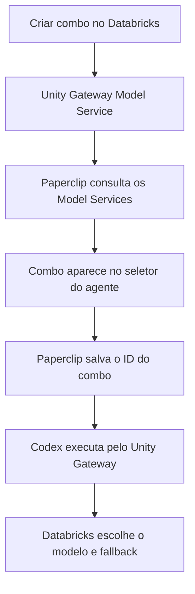

# Especificação — Paperclip + Databricks Unity Gateway com combos dinâmicos

**Status:** pronto para implementação  
**Revisão de autenticação:** 24/09/2026  
**Objetivo:** quando um novo combo (Model Service) for criado no Databricks, ele deve aparecer no Paperclip para seleção, sem cadastro duplicado e sem alteração manual de código.

## 1. Resultado esperado

O Paperclip continuará usando o `codex_local` como executor. O Databricks será um provedor nativo de modelos dentro desse adapter.

Fluxo final:



Exemplo:

1. É criado `main.paperclip.combo_ux` no Databricks.
2. O usuário abre ou atualiza o campo **Combo** no Paperclip.
3. O Paperclip mostra **Combo UX**.
4. O agente salva `main.paperclip.combo_ux` como modelo.
5. A execução usa `https://<workspace>/ai-gateway/codex/v1` com `wire_api = "responses"`.

## 2. Decisões de arquitetura

### 2.1 Não criar outro executor

Não criar um adapter que replique toda a execução do Codex. O adapter continua sendo:

```text
adapterType = codex_local
modelProvider = databricks
model = main.paperclip.combo_ux
```

O suporte ao Databricks deve ser implementado como uma integração de provedor de primeira classe dentro do fluxo do `codex_local`.

### 2.2 Fonte única dos combos

A lista oficial vem do Unity Gateway:

```http
GET /api/2.1/unity-catalog/model-services
    ?parent=schemas/main.paperclip
    &page_size=100
    &view=BASIC
```

O endpoint correto para descoberta é **Model Services do Unity Catalog**. Não usar `GET /api/2.0/serving-endpoints`, pois Serving Endpoints é outro recurso.

### 2.3 Identificador salvo

A API de descoberta retorna o nome no formato:

```text
model-services/main.paperclip.combo_ux
```

O Paperclip deve remover somente o prefixo `model-services/` e salvar:

```text
main.paperclip.combo_ux
```

Esse é o valor enviado ao Codex/Databricks como `model`.

### 2.4 Sem fallback silencioso para OpenAI

Se o Databricks estiver indisponível, sem quota ou sem acesso ao combo, a execução deve falhar ou aguardar conforme a política do Paperclip. Nunca desviar silenciosamente para a OpenAI, pois isso quebra o controle de custo e governança.

## 3. Configuração funcional

Adicionar ao Paperclip uma conexão de IA do tipo `databricks` com:

| Campo | Tipo | Regra |
| --- | --- | --- |
| Nome | texto | Ex.: `Databricks Produção` |
| Workspace URL | URL | Somente HTTPS; salvar apenas a origem |
| Client ID | texto | Application ID do service principal atribuído ao workspace |
| Client secret | segredo | Segredo OAuth do service principal; nunca retornar ao cliente |
| Catalog | texto | Ex.: `main` |
| Schema | texto | Ex.: `paperclip` |
| Filtro opcional | texto | Ex.: prefixo `combo_`; vazio lista todos os serviços acessíveis |
| Compartilhamento | enum | pessoal ou organização, conforme o modelo atual de AI Connections |

Variáveis internas de execução (somente no processo de autenticação com escopo da organização):

```text
DATABRICKS_HOST=https://<workspace>.cloud.databricks.com
DATABRICKS_CLIENT_ID=<application-id>
DATABRICKS_CLIENT_SECRET=<segredo OAuth>
```

Não persistir o client secret nem tokens de acesso no `adapterConfig`, `config.toml`, eventos, logs ou resposta da API. Não usar `DATABRICKS_TOKEN` fixo: ele expira e pode fazer tarefas longas falharem. A conexão do Paperclip armazena o secret cifrado no mecanismo de AI Connections, ligado a uma organização e a um grant.

### 3.1 Preparação no Databricks

1. Criar um service principal para a organização (idealmente um por organização para que permissões e limites sejam atribuídos separadamente) e atribuí-lo ao workspace de destino.
2. Criar um OAuth secret desse principal e copiar uma vez o **Client ID** (Application ID) e o **Client secret**. Configurar validade e rotação do secret. O secret de longa duração é distinto do access token OAuth de cerca de uma hora.
3. Conceder `USE_CATALOG` e `USE_SCHEMA` no catálogo e schema configurados, mais `EXECUTE` somente nos Model Services/combo autorizados. `READ_METADATA` permite descoberta, mas não execução.
4. Configurar os limites do Model Service para esse service principal conforme a governança da organização. Se o mesmo principal for compartilhado por várias organizações, o Databricks verá uma única identidade; evitar isso quando limites/telemetria precisarem ser separados.
5. Validar por conexão com o próprio principal: obter token OAuth M2M, listar os serviços autorizados e executar um combo de teste. Para scopes restritos, confirmar tanto a descoberta (`unity-catalog`) quanto as chamadas de inferência exigidas pela implantação; não presumir que apenas `unity-catalog` habilita o endpoint de inferência.

Para gerar um token manual de diagnóstico, sem salvar seu valor:

```http
POST https://<workspace>/oidc/v1/token
Authorization: Basic base64(client_id:client_secret)
Content-Type: application/x-www-form-urlencoded

grant_type=client_credentials&scope=all-apis
```

`all-apis` é apenas o exemplo de diagnóstico da documentação Databricks; restringir os scopes do secret/token após confirmar os necessários para descoberta e inferência. Em produção, usar autenticação unificada do Databricks para solicitar e renovar tokens automaticamente.

## 4. Contratos do Paperclip

### 4.1 Configuração persistida no agente

```json
{
  "adapterType": "codex_local",
  "adapterConfig": {
    "modelProvider": "databricks",
    "model": "main.paperclip.combo_ux"
  },
  "runtimeConfig": {
    "aiConnection": {
      "provider": "databricks",
      "method": "oauth_m2m",
      "mode": "shared",
      "connectionId": "<uuid>",
      "grantId": "<uuid>"
    }
  }
}
```

### 4.2 Descoberta dos modelos

O contrato atual de `listModels()` não recebe contexto de organização nem credencial. Ele deve ser ampliado de modo retrocompatível:

```ts
interface AdapterModelDiscoveryContext {
  companyId: string;
  provider?: string;
  connectionId?: string;
  refresh?: boolean;
  resolvedCredential?: {
    host: string;
    clientId: string;
    clientSecret: string;
    catalog: string;
    schema: string;
    modelPrefix?: string;
  };
}

listModels?: (
  context?: AdapterModelDiscoveryContext,
) => Promise<AdapterModel[]>;

refreshModels?: (
  context?: AdapterModelDiscoveryContext,
) => Promise<AdapterModel[]>;
```

As implementações existentes podem ignorar o parâmetro.

O endpoint atual permanece:

```http
GET /api/companies/:companyId/adapters/codex_local/models
    ?provider=databricks
    &connectionId=<uuid>
    &refresh=1
```

O servidor deve:

1. validar o acesso do usuário à organização;
2. localizar a conexão dentro da mesma organização;
3. validar o grant pessoal/compartilhado;
4. resolver client ID e secret somente no servidor;
5. obter ou reutilizar token OAuth M2M válido, renovando antes de expirar; chamar a descoberta do Databricks;
6. devolver apenas `id` e `label`.

Resposta ao navegador:

```json
[
  {
    "id": "main.paperclip.combo_ux",
    "label": "Combo UX"
  },
  {
    "id": "main.paperclip.combo_dev",
    "label": "Combo Dev"
  }
]
```

### 4.3 Paginação obrigatória

O Databricks retorna no máximo 100 itens por página. Continuar consultando enquanto existir `next_page_token`:

```ts
do {
  const response = await listModelServices({
    parent: `schemas/${catalog}.${schema}`,
    page_size: 100,
    page_token: nextPageToken,
    view: "BASIC",
  });

  services.push(...response.model_services);
  nextPageToken = response.next_page_token;
} while (nextPageToken);
```

### 4.4 Normalização

Para cada serviço:

```ts
function toAdapterModel(resourceName: string): AdapterModel {
  const id = resourceName.replace(/^model-services\//, "");
  const shortName = id.split(".").at(-1) ?? id;

  return {
    id,
    label: shortName
      .replace(/^combo[-_]?/i, "Combo ")
      .replace(/[-_]+/g, " ")
      .replace(/\b\w/g, (char) => char.toUpperCase())
      .trim(),
  };
}
```

Ordenar pelo `label`. Remover duplicados pelo `id`. Não aceitar nomes fora do `catalog.schema` configurado.

## 5. Execução pelo Unity Gateway com OAuth M2M

O Paperclip deve configurar o `codex_local` por execução com o combo selecionado, sem segredo no TOML. A versão instalada do Codex deve suportar `[model_providers.<id>.auth]` e o gateway `/ai-gateway/codex/v1`; verificar esse suporte na implementação.

```toml
model = "main.paperclip.combo_ux"
model_provider = "databricks"

[model_providers.databricks]
name = "Databricks Unity Gateway"
base_url = "https://<workspace>.cloud.databricks.com/ai-gateway/codex/v1"
wire_api = "responses"
supports_websockets = false

[model_providers.databricks.auth]
command = "/opt/paperclip/bin/databricks-oauth-token"
args = []
timeout_ms = 5000
refresh_interval_ms = 1800000
```

O caminho acima representa o helper a instalar no servidor Paperclip. Ele deve realizar OAuth M2M em `POST https://<workspace>/oidc/v1/token` com `grant_type=client_credentials` e as credenciais do service principal, extrair `access_token` com parser JSON, imprimir **somente o valor do token** em stdout e emitir erro sanitizado em stderr. Pode usar um SDK Databricks que exponha o token M2M à integração, desde que isso seja confirmado na implementação. **Não usar `databricks auth token`: esse comando da CLI suporta somente OAuth de usuário (U2M), não client ID e secret M2M.** O TOML efetivo deve apontar `command` para o caminho absoluto desse helper e usar argumentos fixos sem segredos; nunca usar shell com interpolação de host ou credenciais. Validar antes que a versão do Codex aceita o comando de autenticação, a renovação e `supports_websockets = false`.

O helper recebe somente o contexto da conexão selecionada para aquela execução. O runtime resolve o `clientId`/`clientSecret` da mesma organização, fornece as credenciais ao helper em canal protegido e garante que uma execução de outra organização não consiga invocá-lo ou ler essas credenciais. Um processo Codex capaz de executar comandos no mesmo ambiente pode alcançar segredos herdados; por isso, o isolamento do processo por organização/execução e a separação entre processo de autenticação e ferramentas do agente são requisitos para multi-tenant. Se o adapter atual não oferece essa separação, implementá-la antes de habilitar o conector para múltiplas organizações.

Fluxo do helper:

1. No início e aproximadamente a cada 30 minutos, obter um novo access token por OAuth M2M do workspace correspondente; usar as credenciais e o host da conexão selecionada, nunca as do ambiente global.
2. Entregar o token apenas ao Codex em memória/stdout do comando de autenticação. Não expor o secret ou o token em parâmetros de processo, TOML, logs, eventos, prompt ou browser.
3. Em falha de renovação, retornar erro autenticável/sanitizado e bloquear a chamada. Nunca usar identidade de outra conexão ou OpenAI como fallback.
4. Na revogação/rotação do secret, invalidar qualquer token em cache do Paperclip e impedir novas execuções com essa conexão. Tokens OAuth já emitidos podem permanecer válidos até expirar no Databricks; interromper execuções em andamento quando a revogação da conexão exigir bloqueio imediato. Preservar e limpar a configuração de execução conforme o ciclo de vida do adapter.

O mecanismo `PAPERCLIP_CODEX_PROVIDERS` pode continuar gerando a configuração do provider, mas precisa aceitar `auth.command` com renovação. Em Databricks, a prontidão do `codex_local` deve verificar a conexão M2M, a disponibilidade do helper e o acesso ao combo; não exigir `OPENAI_API_KEY` ou `DATABRICKS_TOKEN` estático. O teste de conectividade não deve disparar tarefa longa. A autenticação com client credentials acontece nos bastidores e permanece invisível para quem seleciona o combo.

## 6. Interface

Na configuração do agente Codex:

```text
Provedor de modelo
└── OpenAI
└── Databricks Unity Gateway

Conexão Databricks
└── Databricks Produção

Combo
└── Combo Econômico
└── Combo Dev
└── Combo Review
└── Combo UX
```

Regras:

- Ao escolher Databricks, exigir uma conexão válida antes de listar combos.
- Buscar a lista ao abrir o seletor.
- Manter botão **Atualizar combos** usando `refresh=1`.
- Cache normal de no máximo 60 segundos.
- O refresh manual ignora o cache.
- Se o combo salvo tiver sido removido, mantê-lo visível como `Indisponível` e bloquear nova execução até a seleção ser corrigida.
- Não misturar modelos OpenAI com combos Databricks na mesma lista.
- Trocar o rótulo `Model` por `Combo` quando `modelProvider = databricks`.

## 7. Cache e isolamento multi-tenant

Chave do cache:

```text
companyId + connectionId + credentialVersion + databricksHost + catalog + schema + modelPrefix
```

Nunca usar apenas `provider=databricks` como chave. Isso poderia exibir combos de uma organização para outra.

Regras adicionais:

- TTL: 60 segundos.
- Não persistir respostas de descoberta no banco no MVP.
- Não compartilhar cache entre organizações, conexões ou versões de credencial diferentes.
- Invalidar ao editar, rotacionar ou revogar a conexão.
- Retornar somente serviços que o service principal daquela conexão pode acessar.

## 8. Segurança

- Armazenar somente o OAuth client secret no sistema de segredos/AI Connections usado pelo Paperclip; manter access tokens efêmeros em memória e em cache associado à conexão/versão.
- Nunca enviar client secret nem access token ao navegador.
- Nunca incluir client secret ou token em URL, argumento de processo, TOML, log, erro, evento, prompt ou telemetria.
- Não repassar credenciais do service principal às ferramentas executadas pelo agente; isolar processos e arquivos por organização/execução.
- Aceitar somente `https://` para o workspace.
- Normalizar a URL para `origin`; rejeitar `userinfo`, query string e fragmento.
- Adotar allowlist de host para ambientes SaaS. Hosts privados devem ser habilitados explicitamente pelo administrador.
- Aplicar timeout de 10 segundos e limite de resposta na descoberta.
- Tratar `401` como credencial inválida, `403` como permissão insuficiente, `429` como limite/quota e `5xx` como indisponibilidade temporária.
- Respeitar `Retry-After` quando existir.
- Não realizar fallback para credencial global de outra organização.

Permissões mínimas recomendadas no Databricks:

- `USE_CATALOG` no catálogo;
- `USE_SCHEMA` no schema;
- `EXECUTE` nos Model Services que devem aparecer e ser executados. `READ_METADATA` isolado serve para descoberta, mas produziria um combo que não executa.
- Workspace atribuído ao principal; OAuth secret com scopes suficientes para listar e inferir.

## 9. Economia e contabilização de tokens

O Paperclip deve registrar:

```text
provider = databricks
model = main.paperclip.combo_ux
inputTokens
outputTokens
cachedTokens, quando informado
latência
status HTTP
```

O modelo real escolhido dentro do combo pertence ao Databricks. Não inventar esse valor no Paperclip. Só registrar o destino real se o Databricks o devolver de forma confiável em metadados da resposta ou telemetria.

Para reduzir consumo:

- evitar chamada de LLM durante a descoberta;
- usar apenas a API REST de Model Services;
- manter cache curto de 60 segundos;
- não carregar descrição completa, destinos ou regras com `view=FULL` no seletor;
- usar `view=BASIC`;
- não enviar a lista de combos no prompt do agente.

## 10. Arquivos previstos no repositório Paperclip

### Compartilhado

- `packages/shared/src/ai-connections.ts`
  - adicionar provider `databricks`;
  - adicionar método `oauth_m2m` para Databricks;
  - mapear para `codex_local` e credenciais M2M do service principal.
- `packages/adapter-utils/src/types.ts`
  - adicionar `AdapterModelDiscoveryContext`;
  - tornar `listModels` e `refreshModels` contextuais e retrocompatíveis.

### Servidor

- `server/src/adapters/registry.ts`
  - encaminhar o contexto para `listModels`/`refreshModels`.
- `server/src/routes/agents.ts`
  - aceitar `provider=databricks` e `connectionId`;
  - resolver e autorizar a conexão antes da descoberta.
- `server/src/services/ai-connections.ts`
  - resolver client ID e secret com escopo de organização/grant, incluindo versão e revogação.
- `server/src/services/ai-connection-runtime.ts`
  - preparar autenticação M2M por execução e configuração do provider sem token fixo.
- novo `server/src/services/databricks-model-services.ts`
  - cliente REST, paginação, cache, normalização e mapeamento de erros; usar cliente OAuth M2M com renovação.
- `server/src/adapters/codex-models.ts`
  - combinar apenas a fonte correspondente ao provider selecionado.

### Adapter Codex

- `packages/adapters/codex-local/src/server/runtime-config.ts`
  - gerar provider Databricks por execução com `auth.command` e `supports_websockets = false`.
- `packages/adapters/codex-local/src/server/auth-check.ts` e caminhos de readiness
  - verificar M2M/helper e não exigir chave OpenAI quando Databricks estiver ativo.
- `packages/adapters/codex-local/src/server/test.ts`
  - teste de conectividade usando o combo selecionado sem consumir uma tarefa real extensa.

### Interface

- `ui/src/components/AgentConfigForm.tsx`
  - provedor, conexão e seletor de combo;
  - busca ao abrir e refresh manual.
- `ui/src/api/agents.ts`
  - enviar provider e connectionId na descoberta.
- `ui/src/adapters/codex-local/`
  - campos e labels específicos do Databricks.

### Documentação

- `docs/adapters/codex-local.md`
  - configuração e diagnóstico.
- `docs/deploy/environment-variables.md`
  - variáveis apenas para modo single-tenant/administrado, se esse fallback for mantido.

## 11. Ordem de implementação

- [ ] **T01 — Contratos compartilhados:** adicionar `databricks` às AI Connections e criar o contexto de descoberta.
- [ ] **T02 — Cliente Databricks:** implementar listagem paginada, normalização, timeout e erros.
- [ ] **T03 — Segurança:** resolver client ID/secret por organização, validar grants e implementar isolamento dos processos e ferramentas.
- [ ] **T04 — Registro de modelos:** passar contexto por `listAdapterModels` e `refreshAdapterModels`.
- [ ] **T05 — Runtime:** gerar provider Codex com `base_url`, `wire_api`, `supports_websockets = false` e `auth.command` sem segredos.
- [ ] **T06 — Autenticação:** criar helper OAuth M2M com renovação e parser de token; remover dependência obrigatória de `OPENAI_API_KEY` quando Databricks estiver ativo.
- [ ] **T07 — API:** ampliar o endpoint de modelos com provider/conexão e cache de 60 segundos.
- [ ] **T08 — UI:** adicionar seleção de provedor, conexão e combo com refresh.
- [ ] **T09 — Observabilidade:** registrar provider, combo, tokens, latência e erros sem segredos.
- [ ] **T10 — Testes unitários e de integração:** cobrir paginação, cache, autorização, runtime, renovação OAuth e erros.
- [ ] **T11 — Teste E2E:** criar `combo_ux` no Databricks e confirmar aparecimento/execução no Paperclip.
- [ ] **T12 — Revisão final:** verificar que todo o escopo e critérios de aceite foram atendidos.

## 12. Testes obrigatórios

### Unitários

- remove apenas o prefixo `model-services/`;
- transforma `combo_ux` em `Combo UX`;
- pagina até `next_page_token` desaparecer;
- ordena e remove duplicados;
- respeita prefixo opcional;
- não devolve serviços de outro schema;
- `refresh=1` ignora cache;
- `401`, `403`, `429`, timeout e `5xx` são classificados corretamente;
- logs e erros não contêm client secret nem access token;
- o helper extrai `access_token`, imprime só o token e rejeita resposta JSON malformada;
- a renovação antecede a expiração e falhas não trocam de conexão.

### Integração

- organização A não enxerga combos da conexão da organização B;
- usuário sem acesso ao grant recebe `403`;
- conexão revogada não pode listar nem executar;
- novo combo aparece após refresh sem reiniciar o Paperclip;
- combo removido não provoca fallback para OpenAI;
- o provider temporário contém `/ai-gateway/codex/v1`, `wire_api=responses`, `auth.command` e nenhum segredo;
- a autenticação renova token numa tarefa com duração superior a uma hora;
- o navegador e o banco não recebem access token; apenas o segredo cifrado permanece nas AI Connections;
- tarefas da organização B não podem ler credenciais ou acionar o helper da organização A;
- a execução envia exatamente o ID selecionado no campo `model`.

### E2E manual

1. Criar e atribuir um service principal no Databricks; conceder `USE_CATALOG`, `USE_SCHEMA` e `EXECUTE` nos combos de teste.
2. Criar OAuth secret e cadastrar workspace URL, client ID e client secret numa conexão Databricks no Paperclip.
3. Selecionar `main.paperclip.combo_dev` e executar uma tarefa curta.
4. Criar `main.paperclip.combo_ux` no Databricks e conceder `EXECUTE` ao principal.
5. Abrir o seletor ou clicar em **Atualizar combos**.
6. Confirmar que **Combo UX** aparece sem editar código ou reiniciar serviços.
7. Selecionar o combo e executar uma tarefa.
8. Confirmar no Databricks que a chamada foi atribuída ao Model Service correto e ao service principal esperado.
9. Manter uma execução por mais de uma hora e confirmar a renovação do token.
10. Revogar a permissão/rotacionar o secret e confirmar que o Paperclip bloqueia acesso indevido sem expor credenciais.

## 13. Critérios de aceite

- [ ] Um Model Service novo aparece no Paperclip sem cadastro manual duplicado.
- [ ] A descoberta usa `/api/2.1/unity-catalog/model-services` com `parent=schemas/<catalog>.<schema>`.
- [ ] O ID salvo e executado é o nome qualificado sem `model-services/`.
- [ ] O Codex usa `/ai-gateway/codex/v1`, Responses API e autenticação OAuth M2M renovável.
- [ ] Não existe fallback silencioso para OpenAI.
- [ ] Nenhum client secret/access token chega ao navegador, logs ou TOML; não há credenciais de uma organização em ferramentas de outra.
- [ ] O isolamento por organização está coberto por teste.
- [ ] Paginação, cache, refresh e renovação de token em tarefas longas funcionam.
- [ ] Erros de quota e permissão são claros e acionáveis.
- [ ] Typecheck, testes direcionados, `pnpm test` e build passam.

## 14. Fora do MVP

- criar ou editar combos do Databricks dentro do Paperclip;
- provisionamento automático de service principals e rotação automática do client secret de longa duração (a renovação automática do access token está no MVP);
- mostrar visualmente cada destino interno e percentual do combo;
- alterar as regras de routing/fallback do Databricks;
- sincronização em tempo real por webhook;
- cálculo do custo real por destino quando o Databricks não fornecer esse dado.

## 15. Referências validadas

- [Paperclip — repositório e arquitetura de adapters](https://github.com/paperclipai/paperclip)
- [Paperclip — registry com `listModels` e `refreshModels`](https://github.com/paperclipai/paperclip/blob/master/server/src/adapters/registry.ts)
- [Databricks — integração com Codex e `ai-gateway/codex/v1`](https://docs.databricks.com/aws/en/ai-gateway/coding-agent-integration-model-services)
- [Databricks — API de Model Services do Unity Gateway](https://docs.databricks.com/api/ai-gateway/v1/model-service)
- [Databricks — OAuth M2M para service principals](https://docs.databricks.com/aws/en/dev-tools/auth/oauth-m2m)
- [Databricks — `auth token` da CLI suporta apenas U2M](https://docs.databricks.com/aws/en/dev-tools/cli/reference/auth-commands)
- [Databricks — configuração do Codex](https://docs.databricks.com/aws/en/ai-gateway/coding-agent-codex)

---

### Resumo da implementação

```text
Paperclip codex_local
  -> conexão M2M do service principal da organização
  -> lista Model Services do schema autorizado
  -> mostra os combos no seletor
  -> salva o nome qualificado do combo
  -> autentica/renova OAuth M2M e injeta provider Databricks por execução
  -> Databricks executa routing, limites e fallback
```