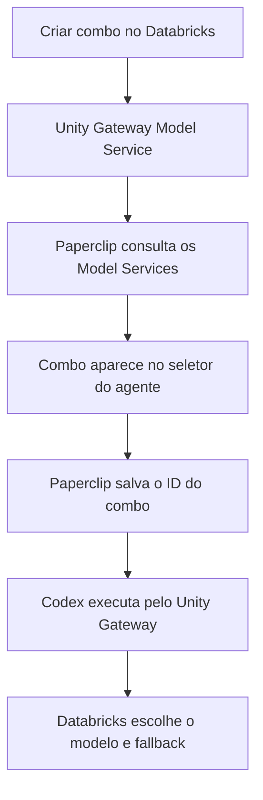

# Especificação — Paperclip + Databricks Unity Gateway com combos dinâmicos

**Status:** pronto para implementação  
**Data de validação:** 21/09/2026  
**Objetivo:** quando um novo combo (Model Service) for criado no Databricks, ele deve aparecer no Paperclip para seleção, sem cadastro duplicado e sem alteração manual de código.

## 1. Resultado esperado

O Paperclip continuará usando o `codex_local` como executor. O Databricks será um provedor nativo de modelos dentro desse adapter.

Fluxo final:



Exemplo:

1. É criado `main.paperclip.combo_ux` no Databricks.
2. O usuário abre ou atualiza o campo **Combo** no Paperclip.
3. O Paperclip mostra **Combo UX**.
4. O agente salva `main.paperclip.combo_ux` como modelo.
5. A execução usa `https://<workspace>/ai-gateway/codex/v1` com `wire_api = "responses"`.

## 2. Decisões de arquitetura

### 2.1 Não criar outro executor

Não criar um adapter que replique toda a execução do Codex. O adapter continua sendo:

```text
adapterType = codex_local
modelProvider = databricks
model = main.paperclip.combo_ux
```

O suporte ao Databricks deve ser implementado como uma integração de provedor de primeira classe dentro do fluxo do `codex_local`.

### 2.2 Fonte única dos combos

A lista oficial vem do Unity Gateway:

```http
GET /api/2.1/unity-catalog/model-services
    ?parent=schemas/main.paperclip
    &page_size=100
    &view=BASIC
```

O endpoint correto para descoberta é **Model Services do Unity Catalog**. Não usar `GET /api/2.0/serving-endpoints`, pois Serving Endpoints é outro recurso.

### 2.3 Identificador salvo

A API de descoberta retorna o nome no formato:

```text
model-services/main.paperclip.combo_ux
```

O Paperclip deve remover somente o prefixo `model-services/` e salvar:

```text
main.paperclip.combo_ux
```

Esse é o valor enviado ao Codex/Databricks como `model`.

### 2.4 Sem fallback silencioso para OpenAI

Se o Databricks estiver indisponível, sem quota ou sem acesso ao combo, a execução deve falhar ou aguardar conforme a política do Paperclip. Nunca desviar silenciosamente para a OpenAI, pois isso quebra o controle de custo e governança.

## 3. Configuração funcional

Adicionar ao Paperclip uma conexão de IA do tipo `databricks` com:

| Campo | Tipo | Regra |
| --- | --- | --- |
| Nome | texto | Ex.: `Databricks Produção` |
| Workspace URL | URL | Somente HTTPS; salvar apenas a origem |
| Token | segredo | PAT no MVP; nunca retornar ao cliente |
| Catalog | texto | Ex.: `main` |
| Schema | texto | Ex.: `paperclip` |
| Filtro opcional | texto | Ex.: prefixo `combo_`; vazio lista todos os serviços acessíveis |
| Compartilhamento | enum | pessoal ou organização, conforme o modelo atual de AI Connections |

Variáveis internas de execução:

```text
DATABRICKS_HOST=https://<workspace>.cloud.databricks.com
DATABRICKS_TOKEN=<segredo resolvido somente durante a execução>
```

Não persistir o token no `adapterConfig`, `config.toml`, eventos, logs ou resposta da API.

## 4. Contratos do Paperclip

### 4.1 Configuração persistida no agente

```json
{
  "adapterType": "codex_local",
  "adapterConfig": {
    "modelProvider": "databricks",
    "model": "main.paperclip.combo_ux"
  },
  "runtimeConfig": {
    "aiConnection": {
      "provider": "databricks",
      "method": "api_key",
      "mode": "shared",
      "connectionId": "<uuid>",
      "grantId": "<uuid>"
    }
  }
}
```

### 4.2 Descoberta dos modelos

O contrato atual de `listModels()` não recebe contexto de organização nem credencial. Ele deve ser ampliado de modo retrocompatível:

```ts
interface AdapterModelDiscoveryContext {
  companyId: string;
  provider?: string;
  connectionId?: string;
  refresh?: boolean;
  resolvedCredential?: {
    token: string;
    host: string;
    catalog: string;
    schema: string;
    modelPrefix?: string;
  };
}

listModels?: (
  context?: AdapterModelDiscoveryContext,
) => Promise<AdapterModel[]>;

refreshModels?: (
  context?: AdapterModelDiscoveryContext,
) => Promise<AdapterModel[]>;
```

As implementações existentes podem ignorar o parâmetro.

O endpoint atual permanece:

```http
GET /api/companies/:companyId/adapters/codex_local/models
    ?provider=databricks
    &connectionId=<uuid>
    &refresh=1
```

O servidor deve:

1. validar o acesso do usuário à organização;
2. localizar a conexão dentro da mesma organização;
3. validar o grant pessoal/compartilhado;
4. resolver o token somente no servidor;
5. chamar a descoberta do Databricks;
6. devolver apenas `id` e `label`.

Resposta ao navegador:

```json
[
  {
    "id": "main.paperclip.combo_ux",
    "label": "Combo UX"
  },
  {
    "id": "main.paperclip.combo_dev",
    "label": "Combo Dev"
  }
]
```

### 4.3 Paginação obrigatória

O Databricks retorna no máximo 100 itens por página. Continuar consultando enquanto existir `next_page_token`:

```ts
do {
  const response = await listModelServices({
    parent: `schemas/${catalog}.${schema}`,
    page_size: 100,
    page_token: nextPageToken,
    view: "BASIC",
  });

  services.push(...response.model_services);
  nextPageToken = response.next_page_token;
} while (nextPageToken);
```

### 4.4 Normalização

Para cada serviço:

```ts
function toAdapterModel(resourceName: string): AdapterModel {
  const id = resourceName.replace(/^model-services\//, "");
  const shortName = id.split(".").at(-1) ?? id;

  return {
    id,
    label: shortName
      .replace(/^combo[-_]?/i, "Combo ")
      .replace(/[-_]+/g, " ")
      .replace(/\b\w/g, (char) => char.toUpperCase())
      .trim(),
  };
}
```

Ordenar pelo `label`. Remover duplicados pelo `id`. Não aceitar nomes fora do `catalog.schema` configurado.

## 5. Execução pelo Unity Gateway

Antes de iniciar o Codex, o Paperclip deve gerar temporariamente a configuração equivalente a:

```toml
model = "main.paperclip.combo_ux"
model_provider = "databricks"

[model_providers.databricks]
name = "Databricks Unity Gateway"
base_url = "https://<workspace>.cloud.databricks.com/ai-gateway/codex/v1"
env_key = "DATABRICKS_TOKEN"
wire_api = "responses"
```

O mecanismo existente de `PAPERCLIP_CODEX_PROVIDERS` pode ser reutilizado internamente, mas a UI não deve exigir que o usuário escreva JSON manualmente.

Exemplo interno:

```json
{
  "providers": {
    "databricks": {
      "name": "Databricks Unity Gateway",
      "base_url": "https://<workspace>.cloud.databricks.com/ai-gateway/codex/v1",
      "env_key": "DATABRICKS_TOKEN",
      "wire_api": "responses"
    }
  },
  "model_provider": "databricks"
}
```

Alterar a validação de autenticação do `codex_local`: quando um provedor customizado estiver ativo, a prontidão deve considerar o `env_key` desse provedor. Não exigir `OPENAI_API_KEY` quando `DATABRICKS_TOKEN` estiver corretamente resolvido.

Ao terminar a execução, remover o token do ambiente temporário e restaurar o `config.toml` gerenciado, preservando o comportamento já existente do adapter.

## 6. Interface

Na configuração do agente Codex:

```text
Provedor de modelo
└── OpenAI
└── Databricks Unity Gateway

Conexão Databricks
└── Databricks Produção

Combo
└── Combo Econômico
└── Combo Dev
└── Combo Review
└── Combo UX
```

Regras:

- Ao escolher Databricks, exigir uma conexão válida antes de listar combos.
- Buscar a lista ao abrir o seletor.
- Manter botão **Atualizar combos** usando `refresh=1`.
- Cache normal de no máximo 60 segundos.
- O refresh manual ignora o cache.
- Se o combo salvo tiver sido removido, mantê-lo visível como `Indisponível` e bloquear nova execução até a seleção ser corrigida.
- Não misturar modelos OpenAI com combos Databricks na mesma lista.
- Trocar o rótulo `Model` por `Combo` quando `modelProvider = databricks`.

## 7. Cache e isolamento multi-tenant

Chave do cache:

```text
companyId + connectionId + databricksHost + catalog + schema + modelPrefix
```

Nunca usar apenas `provider=databricks` como chave. Isso poderia exibir combos de uma organização para outra.

Regras adicionais:

- TTL: 60 segundos.
- Não persistir respostas de descoberta no banco no MVP.
- Não compartilhar cache entre conexões com tokens diferentes.
- Invalidar ao editar ou revogar a conexão.
- Retornar somente serviços que o token do Databricks pode acessar.

## 8. Segurança

- O token deve ser armazenado no sistema de segredos/AI Connections já usado pelo Paperclip.
- Nunca enviar token ao navegador.
- Nunca incluir token em URL, log, erro, evento, prompt ou telemetria.
- Aceitar somente `https://` para o workspace.
- Normalizar a URL para `origin`; rejeitar `userinfo`, query string e fragmento.
- Adotar allowlist de host para ambientes SaaS. Hosts privados devem ser habilitados explicitamente pelo administrador.
- Aplicar timeout de 10 segundos e limite de resposta na descoberta.
- Tratar `401` como credencial inválida, `403` como permissão insuficiente, `429` como limite/quota e `5xx` como indisponibilidade temporária.
- Respeitar `Retry-After` quando existir.
- Não realizar fallback para credencial global de outra organização.

Permissões mínimas recomendadas no Databricks:

- `USE_CATALOG` no catálogo;
- `USE_SCHEMA` no schema;
- `READ_METADATA` ou `EXECUTE` nos Model Services que devem aparecer;
- `EXECUTE` para executar o combo selecionado.

## 9. Economia e contabilização de tokens

O Paperclip deve registrar:

```text
provider = databricks
model = main.paperclip.combo_ux
inputTokens
outputTokens
cachedTokens, quando informado
latência
status HTTP
```

O modelo real escolhido dentro do combo pertence ao Databricks. Não inventar esse valor no Paperclip. Só registrar o destino real se o Databricks o devolver de forma confiável em metadados da resposta ou telemetria.

Para reduzir consumo:

- evitar chamada de LLM durante a descoberta;
- usar apenas a API REST de Model Services;
- manter cache curto de 60 segundos;
- não carregar descrição completa, destinos ou regras com `view=FULL` no seletor;
- usar `view=BASIC`;
- não enviar a lista de combos no prompt do agente.

## 10. Arquivos previstos no repositório Paperclip

### Compartilhado

- `packages/shared/src/ai-connections.ts`
  - adicionar provider `databricks`;
  - permitir apenas `api_key` no MVP;
  - mapear para `codex_local` e `DATABRICKS_TOKEN`.
- `packages/adapter-utils/src/types.ts`
  - adicionar `AdapterModelDiscoveryContext`;
  - tornar `listModels` e `refreshModels` contextuais e retrocompatíveis.

### Servidor

- `server/src/adapters/registry.ts`
  - encaminhar o contexto para `listModels`/`refreshModels`.
- `server/src/routes/agents.ts`
  - aceitar `provider=databricks` e `connectionId`;
  - resolver e autorizar a conexão antes da descoberta.
- `server/src/services/ai-connections.ts`
  - resolver a credencial Databricks com escopo de organização/grant.
- `server/src/services/ai-connection-runtime.ts`
  - injetar `DATABRICKS_TOKEN` e configuração do provider no runtime.
- novo `server/src/services/databricks-model-services.ts`
  - cliente REST, paginação, cache, normalização e mapeamento de erros.
- `server/src/adapters/codex-models.ts`
  - combinar apenas a fonte correspondente ao provider selecionado.

### Adapter Codex

- `packages/adapters/codex-local/src/server/runtime-config.ts`
  - gerar provider Databricks por execução.
- `packages/adapters/codex-local/src/server/auth-check.ts` e caminhos de readiness
  - aceitar `DATABRICKS_TOKEN` quando o provider ativo for Databricks.
- `packages/adapters/codex-local/src/server/test.ts`
  - teste de conectividade usando o combo selecionado sem consumir uma tarefa real extensa.

### Interface

- `ui/src/components/AgentConfigForm.tsx`
  - provedor, conexão e seletor de combo;
  - busca ao abrir e refresh manual.
- `ui/src/api/agents.ts`
  - enviar provider e connectionId na descoberta.
- `ui/src/adapters/codex-local/`
  - campos e labels específicos do Databricks.

### Documentação

- `docs/adapters/codex-local.md`
  - configuração e diagnóstico.
- `docs/deploy/environment-variables.md`
  - variáveis apenas para modo single-tenant/administrado, se esse fallback for mantido.

## 11. Ordem de implementação

- [ ] **T01 — Contratos compartilhados:** adicionar `databricks` às AI Connections e criar o contexto de descoberta.
- [ ] **T02 — Cliente Databricks:** implementar listagem paginada, normalização, timeout e erros.
- [ ] **T03 — Segurança:** resolver conexão/token por organização e impedir acesso cruzado.
- [ ] **T04 — Registro de modelos:** passar contexto por `listAdapterModels` e `refreshAdapterModels`.
- [ ] **T05 — Runtime:** gerar provider Codex temporário com `base_url`, `env_key` e `wire_api`.
- [ ] **T06 — Autenticação:** remover dependência obrigatória de `OPENAI_API_KEY` quando Databricks estiver ativo.
- [ ] **T07 — API:** ampliar o endpoint de modelos com provider/conexão e cache de 60 segundos.
- [ ] **T08 — UI:** adicionar seleção de provedor, conexão e combo com refresh.
- [ ] **T09 — Observabilidade:** registrar provider, combo, tokens, latência e erros sem segredos.
- [ ] **T10 — Testes unitários e de integração:** cobrir paginação, cache, autorização, runtime e erros.
- [ ] **T11 — Teste E2E:** criar `combo_ux` no Databricks e confirmar aparecimento/execução no Paperclip.
- [ ] **T12 — Revisão final:** verificar que todo o escopo e critérios de aceite foram atendidos.

## 12. Testes obrigatórios

### Unitários

- remove apenas o prefixo `model-services/`;
- transforma `combo_ux` em `Combo UX`;
- pagina até `next_page_token` desaparecer;
- ordena e remove duplicados;
- respeita prefixo opcional;
- não devolve serviços de outro schema;
- `refresh=1` ignora cache;
- `401`, `403`, `429`, timeout e `5xx` são classificados corretamente;
- logs e erros não contêm token.

### Integração

- organização A não enxerga combos da conexão da organização B;
- usuário sem acesso ao grant recebe `403`;
- conexão revogada não pode listar nem executar;
- novo combo aparece após refresh sem reiniciar o Paperclip;
- combo removido não provoca fallback para OpenAI;
- o provider temporário contém `/ai-gateway/codex/v1` e `wire_api=responses`;
- o processo filho recebe `DATABRICKS_TOKEN`, mas o navegador e o banco não recebem o valor;
- a execução envia exatamente o ID selecionado no campo `model`.

### E2E manual

1. Criar uma conexão Databricks no Paperclip.
2. Selecionar `main.paperclip.combo_dev` e executar uma tarefa curta.
3. Criar `main.paperclip.combo_ux` no Databricks.
4. Abrir o seletor ou clicar em **Atualizar combos**.
5. Confirmar que **Combo UX** aparece sem editar código ou reiniciar serviços.
6. Selecionar o combo e executar uma tarefa.
7. Confirmar no Databricks que a chamada foi atribuída ao Model Service correto.
8. Revogar a permissão e confirmar que o Paperclip mostra erro de acesso sem expor o token.

## 13. Critérios de aceite

- [ ] Um Model Service novo aparece no Paperclip sem cadastro manual duplicado.
- [ ] A descoberta usa `/api/2.1/unity-catalog/model-services` com `parent=schemas/<catalog>.<schema>`.
- [ ] O ID salvo e executado é o nome qualificado sem `model-services/`.
- [ ] O Codex usa `/ai-gateway/codex/v1` e Responses API.
- [ ] Não existe fallback silencioso para OpenAI.
- [ ] Nenhum segredo chega ao navegador ou aos logs.
- [ ] O isolamento por organização está coberto por teste.
- [ ] Paginação, cache e refresh funcionam.
- [ ] Erros de quota e permissão são claros e acionáveis.
- [ ] Typecheck, testes direcionados, `pnpm test` e build passam.

## 14. Fora do MVP

- criar ou editar combos do Databricks dentro do Paperclip;
- OAuth/M2M com rotação automática de token;
- mostrar visualmente cada destino interno e percentual do combo;
- alterar as regras de routing/fallback do Databricks;
- sincronização em tempo real por webhook;
- cálculo do custo real por destino quando o Databricks não fornecer esse dado.

## 15. Referências validadas

- [Paperclip — repositório e arquitetura de adapters](https://github.com/paperclipai/paperclip)
- [Paperclip — registry com `listModels` e `refreshModels`](https://github.com/paperclipai/paperclip/blob/master/server/src/adapters/registry.ts)
- [Databricks — integração com Codex e `ai-gateway/codex/v1`](https://docs.databricks.com/aws/en/ai-gateway/coding-agent-integration-model-services)
- [Databricks — API de Model Services do Unity Gateway](https://docs.databricks.com/api/ai-gateway/v1/model-service)

---

### Resumo da implementação

```text
Paperclip codex_local
  -> conexão Databricks da organização
  -> lista Model Services do schema autorizado
  -> mostra os combos no seletor
  -> salva o nome qualificado do combo
  -> injeta provider Databricks no Codex por execução
  -> Databricks executa routing, limites e fallback
```
